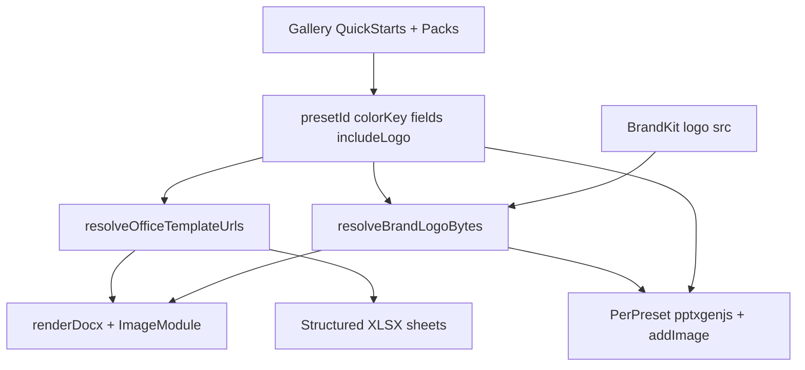

# Pristine Office Templates + Letterhead + Brand Kit Logos

## Problem

The tool works, but outputs under-deliver what the gallery promises:

- DOCX/XLSX from [`scripts/generate-office-sample-templates.mjs`](scripts/generate-office-sample-templates.mjs) are ~2KB stubs (shaded banner + `{tags}`) — not letters, flyers, or trackers
- Preview in [`document-generator/page.tsx`](src/app/[locale]/tools/document-generator/page.tsx) is a generic HTML card, not the Office layout
- Blurbs say “letter / flyer / poster / tracking sheet”; files are unlabeled field dumps
- `_brand` DOCX chrome is fixed `#003366`, while the preview uses live Brand Kit (confusing)
- Brand Kit logos never appear in Word/Excel (only in PNG Comms tools via `BrandLogo`)

## Approach (committed)

Keep color-toggle → discrete baseline files. Raise quality by **authoring richer OOXML/XLSX in the generator script**. Add **Quick starts** (letterhead, simple letter). **Inject Brand Kit logos into DOCX** (and PPTX) at export time. Align PPT per preset. Rewrite preview + copy to match delivered files.

**Logo strategy:** Stay on docxtemplater + PizZip. Add community `docxtemplater-image-module-free` so templates use an image tag (`{%logo}`) in the letterhead region. Resolve bytes from Brand Kit the same way [`BrandLogo`](src/components/brand/BrandLogo.tsx) picks an `src` (official pack path, custom data URL, or platform mark). If logo is missing or user turns the toggle off, leave the image out / empty and keep the text letterhead (`Local {localNumber}`).



## 1. Template quality upgrade (generator script)

Rewrite [`scripts/generate-office-sample-templates.mjs`](scripts/generate-office-sample-templates.mjs) so each preset produces print-ready structure:

| Preset | DOCX shape | XLSX shape |
|--------|------------|------------|
| `letterhead` (new) | Header bar + `{%logo}` + Local / contact + `{body}` body area | none |
| `simple-letter` (new) | Letterhead with `{%logo}`, date, “Dear {memberName},”, `{body}`, “In solidarity,” `{stewardName}` | none |
| `formal-grievance` | Letterhead + logo + subject/title + member/date table + body + steward signature | Sheet **Steps**: Date / Step / Action / Owner / Status |
| `quick-event` | Flyer hierarchy with logo in header strip; When/Where box; body; contact footer | Sheet **RSVP**: Name / Email / Phone / Notes |
| `poster-announcement` | Oversized `{headline}` / `{title}` / `{body}` / `{cta}`; small logo in footer or header | none |

Shared DOCX infrastructure:

- `[Content_Types]` + `word/styles.xml` (Normal + Title + Heading1)
- Sensible `sectPr` page margins
- `letterheadBar(...)` coloured header with text lines + `{%logo}` placeholder tag for the image module
- Closing block (“In solidarity,”)

Keep regenerating `sample-letter.docx` / `sample-roster.xlsx` for unit tests (sample-letter can omit logo tag or include it for image-module tests).

Regenerate all `public/templates/office/**` binaries after script changes.

## 2. Brand Kit logo → DOCX injection

### Dependency

```bash
npm install docxtemplater-image-module-free
```

Wire into [`renderDocx`](src/lib/export/office-export.ts) (dynamic import alongside docxtemplater/pizzip).

### Resolve logo bytes (new helper)

Add `src/lib/export/brand-logo-bytes.ts`:

- Input: `BrandKit` (+ optional `includeLogo: boolean`)
- Reuse the same source selection logic as `BrandLogo` / `resolveLogoMode` in [`LogoSettings.tsx`](src/components/brand/LogoSettings.tsx):
  - Official → fetch `/assets/...` (or configured pack path) as `ArrayBuffer`
  - Custom → decode `customLogoDataUrl` (data URL) to `Uint8Array`
  - Platform mark → fetch UnionOps mark PNG/SVG asset used elsewhere
- Return `{ bytes: Uint8Array; extension: "png" | "jpeg" | "webp"; widthPx; heightPx } | null`
- Cap display size (e.g. max width ~1.5–2.0 in) via module `getSize`
- SVG: prefer raster paths already used for PNG export; if only SVG is available, either skip image injection for that source or convert via canvas in-browser before embed (commit to canvas rasterize for SVG so official/custom SVG still ships)

### docxtemplater ImageModule

- Template tag: `{%logo}` (image-module-free convention)
- `getImage`: return bytes for `{%logo}` from resolved Brand Kit; if null / toggle off, return a 1×1 transparent PNG or skip rendering path so Word still opens cleanly
- Prefer: when `includeLogo` is false or resolve fails, pass empty string and configure nullGetter / module so the document keeps the coloured text letterhead without a broken image frame

### UI

- Checkbox on Document Generator: **Include Brand Kit logo** (default **on** when Brand Kit has a non-placeholder logo / theme established; else off with link to `/onboarding` or Brand Kit — same spirit as solidarity poster branding)
- Store in `GeneratorState.includeLogo`
- Structure preview shows a small logo thumb when on

### PPTX (same pass)

- When `includeLogo` and bytes exist, `pptx.addImage({ data, x, y, w, h })` on title/letterhead slides so Word and PowerPoint both stamp Brand Kit

## 3. Registry + fills

Update [`src/lib/constants/office-templates.ts`](src/lib/constants/office-templates.ts):

- Add presets `letterhead` and `simple-letter` (recommended, DOCX-only, simpler field sets)
- Group metadata: `tier: "quick" | "pack"` for gallery sections
- Soften / replace blurbs so they describe the real layouts (including “Brand Kit logo in letterhead when enabled”)
- Ensure field keys stay aligned with template tags

Update [`src/lib/export/office-fills.ts`](src/lib/export/office-fills.ts) for named sheets (`Steps`, `RSVP`) and column headers.

## 4. PPTX: per-preset decks

Refactor [`renderPptx`](src/lib/export/office-export.ts) to take `presetId` (+ optional logo bytes):

- **letterhead / simple-letter:** 2 slides — letterhead mock + message body
- **formal-grievance:** title + facts + next steps + close
- **quick-event:** flyer title + when/where + CTA
- **poster-announcement:** 2 punchy full-bleed slides

Use contrast-safe ink (reuse / mirror `pickContrastingInk`). Keep client-only generation.

## 5. Page UX revision

In [`document-generator/page.tsx`](src/app/[locale]/tools/document-generator/page.tsx):

1. **Gallery:** “Quick starts” then “Campaign packs”
2. **Preview:** structure list + colour swatches + logo thumb (not a fake poster card)
3. Default preset → `simple-letter`
4. EN/FR copy matches delivery; mention logo injection in subtitle / letterhead blurbs

## 6. Tests and docs

- Unit-test `resolveBrandLogoBytes` with a tiny fixture PNG data URL
- Unit-test `renderDocx` against a letterhead/`simple-letter` template **with** `{%logo}` + image bytes → blob larger than text-only render
- Preset URL / registry tests for new stems
- `renderPptx` with logo still returns non-empty blob
- Update [`docs/PROGRESS.md`](docs/PROGRESS.md), [`docs/modules/COMMS.md`](docs/modules/COMMS.md), [`.cursor/rules/comms-module.mdc`](.cursor/rules/comms-module.mdc) (Office export now includes image-module logo path)

## Explicit non-goals (this pass)

- Live recolor of Word chrome from arbitrary Brand Kit hex (still discrete `_brand` / `_red` / `_blue` files; `_brand` chrome stays neutral navy that pairs with PPT brand colours)
- Authoring binary templates by hand in Microsoft Word outside the script
- Paid docxtemplater commercial image module
