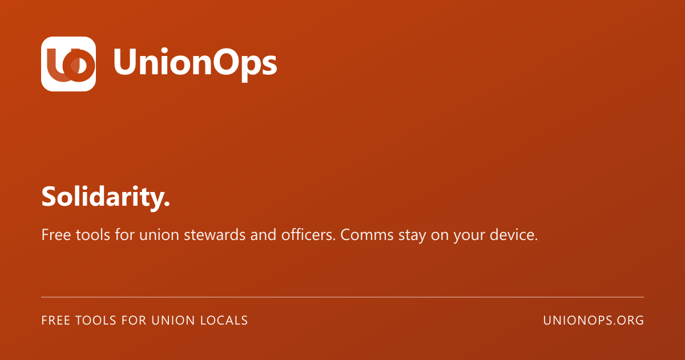

<p align="center">
  
</p>

<h1 align="center">UnionOps</h1>

<p align="center"><strong>Solidarity.</strong></p>

<p align="center">
  Free tools for union stewards and officers — on-device communications,<br />
  grievance tracking, sector workflows, and workforce time.<br />
  Multi-union by design. Self-host the Officer Hub.
</p>

<p align="center">
  <a href="https://unionops.org"><strong>unionops.org</strong></a>
  ·
  <a href="https://unionops.org/en">Try Comms</a>
  ·
  <a href="docs/guides/SETUP.md">Self-host</a>
</p>

<p align="center">
  <a href="https://github.com/hackmods/union-communications/actions/workflows/ci.yml"></a>
  <a href="LICENSE"></a>
  <a href="https://github.com/hackmods/union-communications/pkgs/container/union-communications"></a>
  
  
</p>

<p align="center">
  
</p>

**Stewarded by Ryan Morris.** Source-available · all rights reserved · [LICENSE](LICENSE)

OPSEU/CAAT is the **first adopter** (reference tenant seed), not a platform default. Any union can run with their own branding, CA steps, and enabled modules.

---

## Two surfaces, one platform

| | **Comms toolbox** | **Officer Hub** |
|---|---|---|
| **Who** | Stewards, communicators, any local | Officers, stewards, stability committees |
| **Where** | Public site — no account required | Authenticated `/app` (Auth.js + MFA) |
| **Data** | Browser-side; Brand Kit in `localStorage` | Hosted by **you**; you are the data controller |
| **Try it** | [unionops.org](https://unionops.org/en) | Self-host or local demo logins below |

---

## Comms toolbox — four channels

Guides and generators for **social, print, union boards, and websites**. Everything runs in the browser — no analytics, no upload of member photos to our servers.

| Channel | What you get |
|---------|----------------|
| **Brand** | Brand Kit, Logo Builder, Resizer, Document & Slide Generator (Word / Excel / PowerPoint) |
| **Union boards** | Board Banner & Trim, Board Notice Maker, Solidarity Posters, QR Board / Link Cards |
| **Print & social** | Flyer Maker, Graphic Maker, Quote Cards, Meeting Backgrounds, Alt-text helper |
| **Website** | Static site ZIP (GitHub Pages–ready) + deploy guide |
| **Learn** | First week, Blueprint, Strike Guide, Photo Consent, Comms Resources, channel guides, captions & examples |

Accessibility: font scaling, high contrast, reduced motion — EN/FR throughout.

---

## Officer Hub — what's shipped

Phases **0–5 complete**, plus Workforce Time 8-lite. Memory adapters today; Postgres + RLS is next.

### Casework & deadlines

- **Grievance tracker** — CA-configurable steps, timeline, immutable notes, email drafts (copy only), bundle export (JSON + PDF)
- **Overdue board** — upcoming / overdue sorted by days late
- **Meetings & ICS** — schedule on a grievance; download calendar files
- **Member communication log** — channel, direction, summary

### Sector & time

- **College bumping** — PDF/text compare, stability committee sessions, decision record (committee decides — never auto-decided)
- **Workforce Time (8-lite)** — clock in/out, job codes, approvals, CSV export, optional GPS punch tagging (`/app/time`)

### Officer QOL

- **CA clause snippets** — union-scoped library; insert into notes
- **Within-union marketplace** — share templates with your local only (never cross-union)
- **Officer handoff** — reassign cases + download package (president/admin)
- **Hybrid backup** — passphrase-encrypted export/import; passphrase stays in-browser
- **Steward mobile** — optional read-only compact mode

Role-gated write actions match the API. Confidential modules sit behind MFA.

---

## Privacy (read this)

UnionOps is **local-first for Comms**, not “no servers ever.”

| Surface | What happens to data |
|---------|----------------------|
| **Comms tools** | Graphics, brand kit, and uploads stay in your browser. No analytics. |
| **Officer Hub you host** | Sessions and hub records live on **that instance**. You are the data controller. Prefer Canadian hosting for confidential modules. |
| **Demo / CI accounts** | Workshop and test only — not for real member case files. |

Full policy: [Privacy](https://unionops.org/en/privacy) · [`docs/COMPLIANCE.md`](docs/COMPLIANCE.md) · [`SECURITY.md`](SECURITY.md)

---

## Quick start

```bash
npm ci
cp .env.example .env.local   # set AUTH_SECRET (openssl rand -base64 32)
npm run dev                  # http://localhost:3000/en
```

More detail: [`docs/guides/SETUP.md`](docs/guides/SETUP.md)

### Demo Officer Hub logins (dev / CI only)

Password `demo123`:

| Account | Notes |
|---------|--------|
| `president@local243.ca` | MFA gate (dev accepts any 6-digit code) |
| `stability@local243.ca` | Bumping / stability |
| `steward@local243.ca` | Steward |
| `solo@example.ca` | Solo account — no MFA |

Routes: `/en/app/login` · `/en/app` · `/en/app/mfa`

---

## Deploy

- **Image:** `ghcr.io/hackmods/union-communications:main` (CI on `main`); `:vX.Y.Z` / `:latest` on tags
- **CapRover:** container port **3000**; set `AUTH_SECRET` and `AUTH_URL`
- **Health:** `GET /api/health` → `{"status":"ok"}`

Guide: [`docs/guides/DEPLOY.md`](docs/guides/DEPLOY.md)

**Before production:** unique `AUTH_SECRET`, correct HTTPS `AUTH_URL` (no trailing slash), never use `demo123` for real grievances — if you host it, compliance is on you.

---

## What's next

1. **Postgres + RLS** — every table scoped by `unionId` / `localId`
2. **Multi-union onboarding UI** — tenant signup/invite (seed-only today)
3. **Attachments + virus scan** — grievance docs & bumping PDFs
4. **ApiAdapter** — authenticated API persistence for hub clients
5. **Workforce Time (full)** — scheduling, PTO, union rollup

See [`docs/ROADMAP.md`](docs/ROADMAP.md) and [`docs/PROGRESS.md`](docs/PROGRESS.md).

---

## Documentation

| Doc | Purpose |
|-----|---------|
| [Vision](docs/VISION.md) | Multi-union product scope |
| [Architecture](docs/ARCHITECTURE.md) | Stack, tenancy, DataAdapter |
| [Setup](docs/guides/SETUP.md) / [Deploy](docs/guides/DEPLOY.md) | Operator guides |
| [RBAC](docs/RBAC.md) | Roles — never cross-union data |
| [Compliance](docs/COMPLIANCE.md) | Privacy, AODA |
| [Roadmap](docs/ROADMAP.md) / [Progress](docs/PROGRESS.md) | Phase status |
| [Contributing](CONTRIBUTING.md) | Source-available contribution rules |
| [Security](SECURITY.md) | Vulnerability reporting |
| [Reference tenant](seed/reference-tenant-opseu-caat.json) | OPSEU/CAAT first adopter seed |

Agent entry point: [`AGENTS.md`](AGENTS.md)

---

## Stewardship

UnionOps is stewarded by **Ryan Morris**, intended as a Canadian non-profit / community labour project. The code is source-available under [`LICENSE`](LICENSE): you may run and self-host for your local; redistribution and competing commercial hosting require written permission.

Solidarity.
