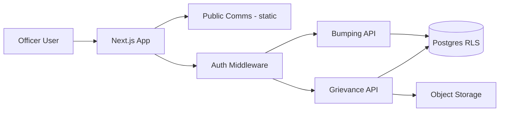

# Architecture

## Overview

Evolution from v1 static comms toolbox to multi-tenant authenticated hub.



## Route Groups (Phase 1+)

| Group | Path | Auth | Notes |
|-------|------|------|-------|
| `(public)` | `/[locale]/tools/*`, guides | None | Existing v1 static export |
| `(app)` | `/[locale]/app/*` | Required | Hub shell |
| `(app)/grievances` | Grievance module | MFA recommended | Highly confidential |
| `(app)/bumping` | College bumping | MFA recommended | Sector-optional |

## Stack

### v1 (current)
- Next.js 16 App Router, TypeScript, Tailwind CSS v4
- Static export (`output: 'export'`)
- next-intl EN/FR
- Zustand + `LocalStorageAdapter` for brand kit
- html-to-image, JSZip, jsPDF (client-side)

### v2+ (planned)
- Next.js with API routes (recommended over separate service for solo host)
- PostgreSQL with Row-Level Security (RLS)
- **Auth.js** + credentials/OAuth for union officer emails; MFA for confidential modules
- S3-compatible object storage for attachments/PDFs; virus scan on upload
- Transactional email for follow-up reminders only — no marketing email

### Auth Options (documented for Phase 1 decision)

| Option | Pros | Cons |
|--------|------|------|
| Auth.js | Self-hosted, flexible, Next.js native | More setup |
| Clerk | Fast MFA, org support | Third-party, cost |
| Supabase Auth | Auth + DB combined | Vendor lock-in |

**Recommendation:** Auth.js + credentials/OAuth for union officer emails.

## DataAdapter Pattern

All persistence goes through [`src/lib/data/adapter.ts`](../src/lib/data/adapter.ts):

| Adapter | Use case |
|---------|----------|
| `LocalStorageAdapter` | v1 comms, hybrid mode local slice |
| `ApiAdapter` | Central hub (Phase 1+) |

Tools never call `localStorage` or fetch directly — always via adapter.

## Multi-Tenancy

Every authenticated row includes:

- `unionId` (required)
- `divisionId` (optional)
- `localId` (required for local-scoped data)

**RLS policies** enforce:
- No cross-union reads
- No cross-local reads except roles with local-wide scope
- `platform_admin` break-glass requires audit log entry

## Union Configuration

`UnionConfig` object per union:

```typescript
{
  unionId: string;
  name: string;
  defaultLocale: "en" | "fr";
  enabledModules: ("comms" | "grievance" | "bumping")[];
  brandDefaults: { primary, secondary, accent };
  grievanceConfig?: CAConfig;
}
```

Reference seed: [`seed/reference-tenant-opseu-caat.json`](../seed/reference-tenant-opseu-caat.json) — OPSEU/CAAT example for dev/demo, not runtime default for new signups.

## Module Registry

Phase 1 shell exposes a module registry. College Bumping only appears when `enabledModules` includes `"bumping"`.

## v1 Migration Debt

OPSEU/CAAT-specific items move to tenant config in Phase 1 — see [`docs/modules/COMMS.md`](modules/COMMS.md).
