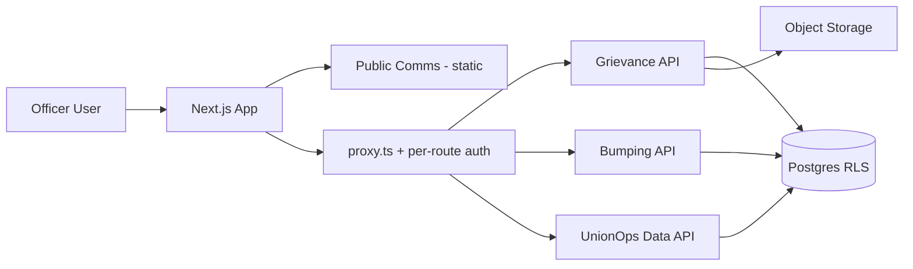

# Architecture

## Overview

Evolution from v1 static comms toolbox to multi-tenant authenticated hub.


```mermaid
flowchart LR
    User[Officer User] --> NextApp[Next.js App]
    NextApp --> PublicComms[Public Comms - static]
    NextApp --> AuthGate[proxy.ts + per-route auth]
    AuthGate --> GrievanceAPI[Grievance API]
    AuthGate --> BumpingAPI[Bumping API]
    AuthGate --> DataAPI[UnionOps Data API]
    GrievanceAPI --> Postgres[(Postgres RLS)]
    BumpingAPI --> Postgres
    DataAPI --> Postgres
    GrievanceAPI --> ObjectStore[Object Storage]
```

## Route Groups (Phase 1+)

| Group | Path | Auth | Notes |
|-------|------|------|-------|
| `(public)` | `/[locale]/tools/*`, guides | None | Existing v1 static export |
| `(app)` | `/[locale]/app/*` | Required | Hub shell |
| `(app)/grievances` | Grievance module | MFA recommended | Highly confidential |
| `(app)/bumping` | College bumping | MFA recommended | Sector-optional |
| `(app)/data` | UnionOps Data | MFA + Postgres required | Local-scoped officer imports and records |

## Route protection (as-built)

There is **no** `middleware.ts`. Next.js 16 gating lives in [`src/proxy.ts`](../src/proxy.ts):

- Matcher excludes `api`, `_next`, `_vercel`, and static file extensions — **API routes are not gated by the proxy** and must call `auth()` / `require*Session()` themselves.
- For matched `/app/*` paths (except login/register), requires an authenticated session or redirects to login.
- Hub pages such as `/app` and `/app/audit` also call `auth()` in Server Components and redirect when unauthenticated.

MFA and tenant context (`localId` / `bargainingUnitId`) are only writable via trusted JWT update paths (server-issued MFA grant nonce; local switch validated against `accessibleLocalIds` / elevated roles).

## Stack

### v1 (current)
- Next.js 16 App Router, TypeScript, Tailwind CSS v4
- Static export (`output: 'export'`)
- next-intl EN/FR
- Zustand + `LocalStorageAdapter` for brand kit
- html-to-image, JSZip, jsPDF (client-side)

### v2+ (planned)
- Next.js with API routes (recommended over separate service for solo host)
- PostgreSQL with Row-Level Security (RLS)
- **Auth.js** + credentials/OAuth for union officer emails; MFA for confidential modules
- S3-compatible object storage for attachments/PDFs; virus scan on upload
- Transactional email for follow-up reminders only — no marketing email

### Auth Options (documented for Phase 1 decision)

| Option | Pros | Cons |
|--------|------|------|
| Auth.js | Self-hosted, flexible, Next.js native | More setup |
| Clerk | Fast MFA, org support | Third-party, cost |
| Supabase Auth | Auth + DB combined | Vendor lock-in |

**Recommendation:** Auth.js + credentials/OAuth for union officer emails.

## DataAdapter Pattern

All persistence goes through [`src/lib/data/adapter.ts`](../src/lib/data/adapter.ts):

| Adapter | Use case |
|---------|----------|
| `LocalStorageAdapter` | Default for all Comms canvas tools + Brand Kit/preferences — on-device sovereignty (ADR-006) |
| `LocalHybridSliceAdapter` | Encrypted grievance/bumping slice in browser (Phase 4) |
| `ApiAdapter` | Opt-in server persistence for Brand Kit + preferences via `GET/PUT /api/brand-kit` and `/api/preferences` (Phase 6) — authenticated Hub users only, memory-backed store keyed by `unionId:userId` until Postgres lands |

Tools never call `localStorage` or fetch directly — always via adapter. `getDataAdapter()` (`src/lib/data/get-data-adapter.ts`) resolves `LocalStorageAdapter` by default and only returns `ApiAdapter` when the user has explicitly opted in via the `unionops-data-adapter-mode` browser preference — never default a whole tenant to `api`.

## Multi-Tenancy

Every authenticated row includes:

- `unionId` (required)
- `divisionId` (optional)
- `localId` (required for local-scoped data)

**RLS policies** enforce:
- No cross-union reads
- No cross-local reads except roles with local-wide scope
- `platform_admin` break-glass requires audit log entry

## Ops health endpoint

`GET /api/health` is unauthenticated and returns a non-secret runtime summary for deploy verification:

| Field | Meaning |
|-------|---------|
| `status` | `"ok"`, or `"degraded"` when Postgres is configured without a valid boot attestation |
| `version` | `package.json` version |
| `commit` | `BUILD_COMMIT_SHA` env (Docker build arg) or `"unknown"` |
| `builtAt` | UTC timestamp from `/app/.build-time` (Docker runner stage) or `BUILD_TIME` env or `"unknown"` |
| `backends` | Map of `*_DB_BACKEND` flags (`memory` default) |
| `databaseDeployment` | Boot-gate attestation: mode, verified flag, schema-qualified journal location, exact image tail, contract version, and verified object counts |
| `emailEnabled` | `EMAIL_ENABLED=true` |
| `cronConfigured` | `CRON_SECRET` is set (does not expose the secret) |
| `mfaEnabled` | `AUTH_MFA_ENABLED=true` |

CLI preflight: `npm run health:check` (optional `HEALTH_URL` or `PLAYWRIGHT_BASE_URL`). Sandbox smoke runs this before Playwright (`npm run test:smoke:sandbox`). `HEAD /api/health` is supported for load balancers.

## Verified database deployment gate

DB updates deploy automatically on boot via [`docker/db-deploy.mjs`](../docker/db-deploy.mjs), wired from `docker/entrypoint.sh`. The image validates its immutable Drizzle journal, takes a PostgreSQL advisory lock, applies pending migrations as the owner, proves the exact image tail in the schema-qualified `__drizzle_migrations` ledger, and verifies the generated table/column/RLS contract before the web process starts. A failure exits 1. `platform_meta`, a second data-migration ledger, and health-only drift detection are not part of the contract. Local equivalent: `npm run db:deploy`; CI integrity check: `npm run db:check`. See [ADR-020](audit/adr-020-database-deployment-contract.md).

## Union Configuration

`UnionConfig` object per union:

```typescript
{
  unionId: string;
  name: string;
  defaultLocale: "en" | "fr";
  enabledModules: ("comms" | "grievance" | "bumping")[];
  brandDefaults: { primary, secondary, accent };
  grievanceConfig?: CAConfig;
}
```

Reference seed: [`seed/reference-tenant-b7p.json`](../seed/reference-tenant-b7p.json) — Behind 7 Proxies (B7P) Hub demo tenant with meme locals (7/404/502/1337). OPSEU/CAAT remains Brand Kit / guide reference material, not the demo login roster. Not a runtime default for new signups.

## Module Registry

Phase 1 shell exposes a module registry. College Bumping only appears when `enabledModules` includes `"bumping"`.

## v1 Migration Debt

OPSEU/CAAT-specific items move to tenant config in Phase 1 — see [`docs/modules/COMMS.md`](modules/COMMS.md).
