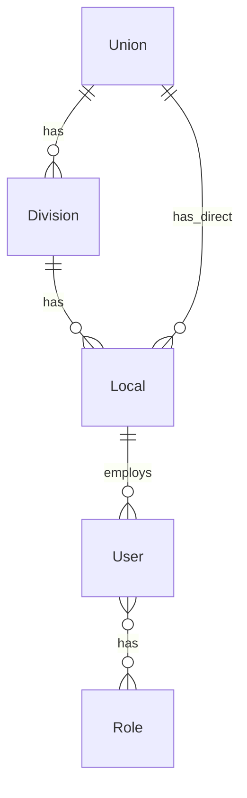

# Data Models

## Tenancy



### Union
```typescript
{ id, name, slug, defaultLocale, enabledModules, brandDefaults, createdAt }
```

### Division (optional)
```typescript
{ id, unionId, name, code, enabledModules }
```

### Local
```typescript
{ id, unionId, divisionId?, localNumber, subText, brandKitId }
```

### User
```typescript
{ id, email, name, mfaEnabled, unionId, localId?, roles[] }
```

### UnionConfig
```typescript
{ unionId, grievanceConfig?: CAConfig, retentionYears: number }
```

## Comms

### BrandKit (v1.1 — client)
```typescript
{
  version: "1.1",
  local: { id, localNumber, subText },
  primaryColor, secondaryColor, accentColor,
  useOfficialLogo, officialLogoVariant?, customLogoDataUrl?, logoText?,
  websiteUrl?, facebookUrl?, customLinks?: { id, label, url }[],
  updatedAt
}
```

### BrandKit (v2 — planned multi-union)
```typescript
{
  version: "2.0",
  unionId, unionName, divisionName?,
  local: { id, localNumber, subText },
  primaryColor, secondaryColor, accentColor,
  useOfficialLogo, customLogoDataUrl?,
  websiteUrl?, facebookUrl?, customLinks?,
  updatedAt
}
```

## Grievance

### Grievance
```typescript
{ id, unionId, localId, memberPseudonym?, category, status, currentStep, filedAt, resolvedAt?, assignedStewardId }
```

### GrievanceEvent
```typescript
{ id, grievanceId, type, stepNumber?, dueAt?, completedAt?, note? }
```

### GrievanceNote
```typescript
{ id, grievanceId, authorId, body, createdAt }  // immutable
```

### CAConfig
```typescript
{ unionId, localId?, steps: { number, name, responseDays }[] }
```

### MemberCommunication (Phase 5)
```typescript
{ id, grievanceId, unionId, localId, channel, direction, summary, occurredAt, loggedById }
```

### ScheduledMeeting (Phase 5)
```typescript
{ id, grievanceId, unionId, localId, title, startsAt, endsAt, location?, description? }
```

### CaSnippet (Phase 5)
```typescript
{ id, unionId, localId?, title, clauseRef, body, tags[], createdById }
```

### SharedTemplate (Phase 5 — within-union only)
```typescript
{ id, unionId, localId, kind, title, description, body, sharedById }
```

## Bumping

### BumpingCase
```typescript
{ id, unionId, localId, memberRef, seniorityDate, currentPosition, scenario, status }
```

### CommitteeSession
```typescript
{ id, bumpingCaseId, date, attendees[], agenda, decisionId? }
```

## Platform

### AuditLog
```typescript
{ id, userId, action, resourceType, resourceId, unionId, localId, timestamp, metadata? }
```

## Notes

- Every query filters by `unionId` minimum
- `localId` required for local-scoped entities
- OPSEU/CAAT v1 code maps to reference seed, not schema defaults
