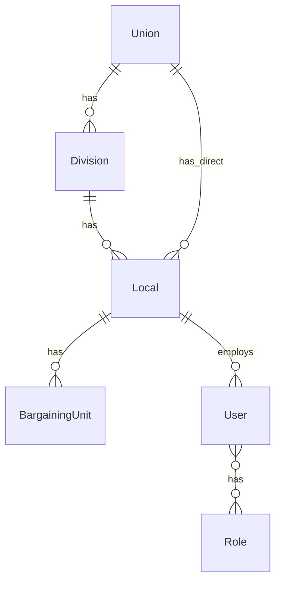

# Data Models

## Tenancy



### Union
```typescript
{ id, name, slug, defaultLocale, enabledModules, brandDefaults, createdAt }
```

### Division (optional)
```typescript
{ id, unionId, name, code, enabledModules }
```

### Local
```typescript
{ id, unionId, divisionId?, localNumber, subText, brandKitId }
```

### BargainingUnit (optional Collection under Local)
```typescript
{ id, unionId, localId, code, name, grievanceConfig? }
```

### User
```typescript
{ id, email, name, mfaEnabled, unionId, localId?, bargainingUnitId?, accessibleLocalIds?, roles[] }
```

### UnionConfig
```typescript
{ unionId, grievanceConfig?: CAConfig, retentionYears: number }
```

## Comms

### BrandKit (v2 — multi-union + profiles)
```typescript
{
  version: "2.0",
  unionId?, unionName?, divisionName?,
  local: { id, localNumber, subText, bargainingUnitCode? },
  profiles?: { id, label, localNumber, subText, bargainingUnitCode? }[],
  activeProfileId?,
  primaryColor, secondaryColor, accentColor,
  useOfficialLogo, customLogoDataUrl?,
  websiteUrl?, facebookUrl?, customLinks?,
  updatedAt
}
```

Legacy v1.1 kits normalize to v2 via `normalizeBrandKit`.

## Grievance

### Grievance
```typescript
{ id, unionId, localId, bargainingUnitId?, memberPseudonym?, category, status, currentStep, filedAt, resolvedAt?, assignedStewardId }
```

### CAConfig resolution
Collection `grievanceConfig` → union fallback (`resolveGrievanceConfig`).

### MemberCommunication / ScheduledMeeting / CaSnippet / SharedTemplate
Carry `unionId` + `localId`; snippets and marketplace may include optional `bargainingUnitId`.

## Attachments (Phase 7 scaffold)

```typescript
{ id, unionId, localId, bargainingUnitId?, grievanceId?, fileName, mimeType, sizeBytes, storageKey, scanStatus, uploadedById }
```

`scanStatus`: `pending` | `clean` | `infected` | `skipped_dev`

## Notes

- Every query filters by `unionId` minimum
- `localId` required for local-scoped entities; `bargainingUnitId` optional
- OPSEU/CAAT maps to reference seed only — not schema defaults
- Active Hub context (JWT): `localId` + `bargainingUnitId` drive list filters
