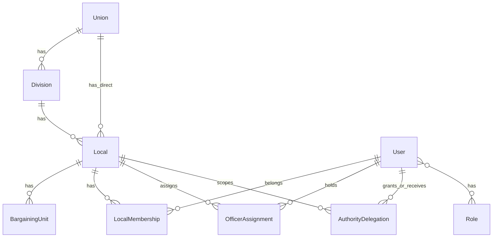

# Data Models

## Tenancy


```mermaid
erDiagram
    Union ||--o{ Division : has
    Division ||--o{ Local : has
    Union ||--o{ Local : has_direct
    Local ||--o{ BargainingUnit : has
    Local ||--o{ LocalMembership : has
    User ||--o{ LocalMembership : belongs
    User ||--o{ OfficerAssignment : holds
    Local ||--o{ OfficerAssignment : assigns
    User ||--o{ AuthorityDelegation : grants_or_receives
    Local ||--o{ AuthorityDelegation : scopes
    User }o--o{ Role : has
```

### Union
```typescript
{ id, name, slug, defaultLocale, enabledModules, membershipPolicy, brandDefaults, createdAt }
```

`membershipPolicy` is `multi_local` (default — many active locals per member) or
`single_local` (at most one active `LocalMembership` per user in the union).
Write paths (assign-local, invites find-or-create, org memberships POST) enforce
`single_local`; the integrity report flags violations.

### Division (optional)
```typescript
{ id, unionId, name, code, enabledModules }
```

### Local
```typescript
{ id, unionId, divisionId?, localNumber, subText, brandKitId }
```

Active (non-archived) local numbers are unique per union
(`locals_union_number_active_uidx`).

### BargainingUnit (optional Collection under Local)
```typescript
{ id, unionId, localId, code, name, grievanceConfig? }
```

### User
```typescript
{ id, email, name, mfaEnabled, unionId, localId?, bargainingUnitId?, accessibleLocalIds?, roles[] }
```

`localId` remains the primary-local compatibility/context value. Durable local
authority comes from `LocalMembership`; `accessibleLocalIds` only offers
context switching and is not a permission grant.

### Organizational authority
```typescript
LocalMembership { unionId, localId, userId, status, isPrimary, bargainingUnitId?, startedAt, endedAt? }
OfficerAssignment { unionId, localId, userId, position, startsAt, endsAt?, revokedAt? }
AuthorityDelegation { unionId, localId, grantorUserId, delegateUserId, capability, startsAt, endsAt, reason, revokedAt? }
```

Uniqueness: one row per `(userId, localId)`; at most one active primary per
`(unionId, userId)` (`local_memberships_primary_active_uidx`).

Canonical positions are president, vice-president, grievance officer,
steward, and executive member. Assignments and delegations are term bounded
and separate from the display-only officer roster.

### UnionConfig
```typescript
{ unionId, grievanceConfig?: CAConfig, retentionYears: number }
```

## Comms

### BrandKit (v2 — multi-union + profiles)
```typescript
{
  version: "2.0",
  unionId?, unionName?, divisionName?,
  local: { id, localNumber, subText, bargainingUnitCode? },
  profiles?: { id, label, localNumber, subText, bargainingUnitCode? }[],
  activeProfileId?,
  primaryColor, secondaryColor, accentColor,
  useOfficialLogo, customLogoDataUrl?,
  websiteUrl?, facebookUrl?, customLinks?,
  updatedAt
}
```

Legacy v1.1 kits normalize to v2 via `normalizeBrandKit`.

## Grievance

### Grievance
```typescript
{ id, unionId, localId, bargainingUnitId?, memberPseudonym?, memberUserId?, privacyMode, category, status, currentStep, filedAt, resolvedAt?, assignedStewardId }
```

`privacyMode` is `standard` or `restricted`. `grievance_participants` records
case-team relationships and access levels; `grievance_member_updates` and
`grievance_attachment_shares` separately publish allowlisted member-safe
content. `assignedStewardId` remains for compatibility and mirrors the primary
case worker.

### CAConfig resolution
Collection `grievanceConfig` → union fallback (`resolveGrievanceConfig`).

### MemberCommunication / ScheduledMeeting / CaSnippet / SharedTemplate
Carry `unionId` + `localId`; snippets and marketplace may include optional `bargainingUnitId`.

## Attachments (Phase 7 scaffold)

```typescript
{ id, unionId, localId, bargainingUnitId?, grievanceId?, fileName, mimeType, sizeBytes, storageKey, scanStatus, uploadedById }
```

`scanStatus`: `pending` | `clean` | `infected` | `skipped_dev`

## Notes

- Every query filters by `unionId` minimum
- `localId` required for local-scoped entities; absent local context fails closed
- Postgres actor resolution reloads current membership/office/delegation rows
- Portal records use the async memory/Postgres adapter contract. Postgres
  persistence and RLS are covered by migrations `0043`–`0052`; backend choice
  remains opt-in through `PORTAL_DB_BACKEND`. The combined chain, a
  `0039`-era upgrade fixture, restricted-role RLS and durability smokes, and a
  standalone process-restart smoke passed on an isolated database. Keep these
  checks in CI; production cutover requires preserving runtime-only memory
  data, full adapter parity, and staged operator approval.
- OPSEU/CAAT maps to reference seed only — not schema defaults
- Active Hub context (JWT): `localId` + `bargainingUnitId` drive list filters
