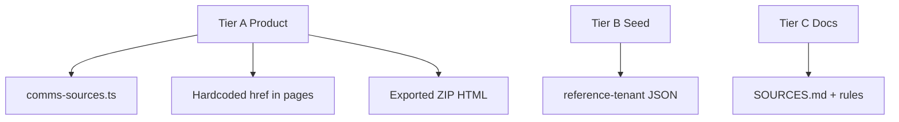

# External links audit — plan & inventory

**Ticket:** [`LINK-001`](execution-backlog.md#link-001--open-2026-07-30) in `execution-backlog.md`  
**Canonical product registry:** [`src/lib/constants/comms-sources.ts`](../../src/lib/constants/comms-sources.ts)  
**Human bibliography:** [`docs/SOURCES.md`](../SOURCES.md)  
**Agent rules:** [`.cursor/rules/external-links.mdc`](../../.cursor/rules/external-links.mdc)

Opened **2026-07-30** after stewards reported dead national-union citations (e.g. OPSEU graphics deep link `/12263`). This doc is the working inventory and verification playbook; URL fixes land under LINK-001 acceptance criteria.

---

## Replace vs remove (default policy)

| Situation | Action |
|-----------|--------|
| Official page moved; same resource exists elsewhere | **Replace** URL in `COMMS_SOURCES` (+ mirrors) |
| Deep CMS URL 404; stable hub page exists | **Replace** with hub URL; note in `CommsSource.note` |
| National page gone; UnionOps mirrors assets in-product | **Replace** with internal `/[locale]/assets` **or** national homepage + copy that pack is mirrored locally — do **not** drop authority citation silently |
| Duplicate hardcoded URL outside registry | **Remove duplicate**; read from registry |
| Exported website ZIP footer (reference tenant) | **Replace** when national URLs change; long-term wire from `COMMS_SOURCES` or tenant config |
| Seed `membershipUrls` to national forms | **Replace** when dead; keep row so stewards edit in Brand Kit |
| Docs / workshop / `.cursor` only | **Replace** when Tier A changes; lower urgency |
| Demo emails (`caat-admin@opseu.org`) | **Keep** — not navigational |
| `localhost`, `example.com`, XML namespaces | **Exempt** from external checks |

**Do not remove** branding citations from guides without replacement text — they document alignment with national guidelines, not sole access to files (`public/assets/caat-opseu/`, `/assets`).

---

## Audit tiers

| Tier | Scope | User impact |
|------|--------|-------------|
| **A** | `comms-sources.ts`, `SourcesBlock`, hardcoded UI links, `generate-website-zip.ts` footers | Highest — stewards click these |
| **B** | `seed/reference-tenant-opseu-caat.json` membership URLs | Reference tenant defaults |
| **C** | `docs/SOURCES.md`, workshop, `.cursor/rules`, `docs/PROGRESS.md` | Facilitator + agents |
| **D** | Exempt fixtures | Skip automated crawl |



---

## Tier A inventory (verified paths in repo)

| `id` / key | URL (as in repo) | Locations beyond registry |
|------------|------------------|---------------------------|
| `opseu-branding` | `https://opseu.org/information/opseu-graphics-logos-and-letterhead-templates/12263` | `src/app/[locale]/assets/page.tsx` (duplicate href), `.cursor/rules/opseu-branding.mdc`, `docs/SOURCES.md`, `docs/workshop/aug-18-comms-toolbox.md` |
| `opseu-member-portal` | `https://members.opseu.org/` | `generate-website-zip.ts` |
| `opseu-collective-agreements` | `https://opseu.org/bargaining/collective-agreements-and-arbitration-awards/` | `generate-website-zip.ts` |
| `opseu-forms` | `https://opseu.org/about-opseu-sefpo/forms-documents/` | `generate-website-zip.ts` |
| `local243-website` | `https://local243.org` | workshop doc |
| Platform / a11y / Ontario | see `COMMS_SOURCES` | QR presets (`qr-card-presets.ts`) overlap Ontario URLs — separate pass if needed |

**Registry consumers:** `PAGE_SOURCE_IDS` maps guides/tools → source ids; `SourcesBlock` renders Tier A links on blueprint, print, union-boards, crisis, assets, board tools, `/guide/resources`, etc.

**Known duplication defect:** `/assets` guidelines list hardcodes `opseu-branding` URL instead of importing `COMMS_SOURCES["opseu-branding"]` — fix in LINK-001 Phase 4.

**Known report (2026-07-30):** OPSEU graphics deep link fails in browser for stewards. Automated HEAD may return **403** (Cloudflare) — **browser verification is source of truth** for `opseu.org`.

**Replacement candidates to verify in browser before editing registry:**

- Same path with trailing slash
- `https://opseu.org/about/` (“Download graphics”)
- `https://opseu.org/opseu-members-tools-and-resources/`

---

## Tier B inventory

| URL | Location |
|-----|----------|
| `https://hub03.opseu.org/Forms/emaweb` | `seed/reference-tenant-opseu-caat.json` (membership URLs) |

Confirm with stewards whether hub03 forms URL still valid.

---

## Phase 1 — Spreadsheet export

Columns: `id`, `url`, `tier`, `locations`, `purpose`, `canonical`, `browser_status`, `http_status`, `replacement_url`, `verified_date`.

PowerShell inventory helpers:

```powershell
rg "https://[^\s\"']+" src --glob "*.{ts,tsx}" | Out-File link-inventory-src.txt
rg "opseu\.org" .
rg "opseu\.org/information/opseu-graphics" .
```

Merge output with `docs/SOURCES.md` table.

---

## Phase 2 — Verification (two-pass)

1. **Browser pass (authoritative):** Each Tier A URL — OK / 404 / redirect / login wall. Log final URL after redirects.
2. **Optional CI / script:** e.g. [lychee](https://github.com/lycheeorg/lychee) on extracted `COMMS_SOURCES` URLs; browser-like User-Agent; accept 200/301/302; flag 404/410; manual review for 403 on `opseu.org`. **No merge blocker on 403 alone.**

---

## Phase 3 — Remediation order (LINK-001 implementation)

1. Update `COMMS_SOURCES` URLs + optional `lastVerified` field on `CommsSource`.
2. Deduplicate `assets/page.tsx` → registry.
3. Sync `docs/SOURCES.md`, `opseu-branding.mdc`, workshop doc.
4. `generate-website-zip.ts` — update OPSEU footer links or import from registry for reference export.
5. `seed/reference-tenant-opseu-caat.json` if hub URLs dead.
6. Extend `comms-sources.test.ts` (unique URLs, no stray duplicates in Tier A files).

---

## Phase 4 — Acceptance criteria

- [ ] Every Tier A URL browser-verified; decision log row per change (`was → now → date`).
- [ ] Zero duplicate OPSEU branding URLs outside `comms-sources.ts` (except tests asserting export HTML).
- [ ] `docs/SOURCES.md` matches registry.
- [ ] Optional: weekly lychee job on registry extract (403 allowlist for national union host).

---

## Decision log

| Date | URL | Outcome | Notes |
|------|-----|---------|-------|
| 2026-07-30 | `…/12263` (opseu-branding) | **Open** | Reported broken; audit ticket opened; registry unchanged pending browser confirmation |
