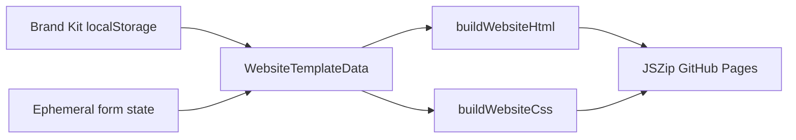
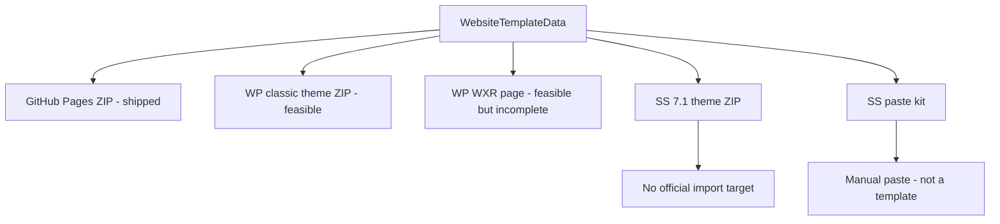

# Plan — Website Template → WordPress / Squarespace export (2026-08-18)

**Audience:** Ryan + future agents.  
**Status:** Phase 0 documented. Phase 1 (classic WordPress theme ZIP) **shipped 2026-08-18**. GitHub Pages remains the default export. UnionOps does **not** support WordPress.  
**Companion:** [`session-knowledge-2026-08-18-website-export.md`](session-knowledge-2026-08-18-website-export.md), [`.cursor/rules/website-export.mdc`](../../.cursor/rules/website-export.mdc), [`../modules/COMMS.md`](../modules/COMMS.md).

**Verdict:** WordPress export is **feasible** (classic theme wrap of today’s GitHub Pages ZIP; WXR is a weaker content-only path). Squarespace **7.1 theme / developer-mode / template ZIP export is a non-option**. A Squarespace “paste kit” is the only honest consolation, and it is not an importer.

---

## 1. Current state assessment

UnionOps does **not** ship a website CMS, page builder, or block tree. The product is **Website Template** (`/[locale]/tools/website-template`): a **single-page static site generator** modeled on [local243.org](https://local243.org).

| Concern | As-built |
|---------|----------|
| Pages | One `index.html` with in-page anchors (`#home`, `#about`, `#leadership`, `#contact`) |
| Layout | Fixed HTML in `buildWebsiteHtml()` — not user-rearrangeable |
| Content model | Flat form object [`WebsiteTemplateData`](../../src/types/website-template.ts) |
| Styles | Generated CSS string `buildWebsiteCss()` from Brand Kit colours + canvas tokens |
| Persistence | Brand Kit via `DataAdapter` / localStorage; **page copy is ephemeral React state** (lost on refresh) |
| Export today | Client-side JSZip: `index.html`, `css/style.css`, `js/site.js`, logo/hero/fonts, README (GitHub Pages) |
| Forms | None — `mailto:` only |
| Hosting | Steward self-hosts (guide at `/guide/website`) |

### Core type (no blocks, no pages array)

```ts
// src/types/website-template.ts
export interface WebsiteTemplateData {
  localNumber: string;
  unionName: string;
  heroText: string;
  about1: string;
  about2: string;
  contactEmail: string;
  facebookUrl: string;
  customLinks?: WebsiteNavLink[];
  membershipLinks?: WebsiteNavLink[];
  officeAddress: string;
  primaryColor: string;
  secondaryColor: string;
  officers: WebsiteOfficer[];
  logoFileName: string;
  logoPreviewSrc: string;
  logoAlt: string;
  includeOpseuResources: boolean;
  heroArtId?: string;
  heroImageFileName?: string;
  heroImagePreviewSrc?: string;
  heroImageAlt?: string;
  canvas?: { surface?: …; typeScale?: …; density?: …; headlineFontId?: …; bodyFontId?: … };
}
```

### Key files

| File | Role |
|------|------|
| [`src/types/website-template.ts`](../../src/types/website-template.ts) | `WebsiteTemplateData`, officers, nav links |
| [`src/lib/templates/website/generate-website-zip.ts`](../../src/lib/templates/website/generate-website-zip.ts) | `buildWebsiteHtml` / `buildWebsiteCss` / `buildWebsiteJs` / `generateWebsiteZip` |
| [`src/lib/templates/website/hero-art.ts`](../../src/lib/templates/website/hero-art.ts) | Hero pattern catalog vs uploaded photo |
| [`src/lib/templates/website/brand-kit-fields.ts`](../../src/lib/templates/website/brand-kit-fields.ts) | Brand Kit → display name, nav link sanitization |
| [`src/app/[locale]/tools/website-template/page.tsx`](../../src/app/[locale]/tools/website-template/page.tsx) | Form UI + ephemeral copy state |
| [`src/components/tools/WebsitePreviewFrame.tsx`](../../src/components/tools/WebsitePreviewFrame.tsx) | iframe `srcdoc` preview |

### Pipeline



**Structural implication:** we are not mapping a CMS schema to another CMS. We are wrapping **one branded landing page**. That makes WordPress *easier* than a real site builder would be, and it makes “theme for Squarespace 7.1” a category error — 7.1 has no third-party theme package to wrap.

This is a **page/layout export tool** with a **fixed template**, not a multi-page site management product. Canvas tools (Flyer Maker, Graphic Maker) are a different pipeline (`html-to-image` PNG/PDF). Do not reuse that stack for website CMS export.

---

## 2. Technical approach (WordPress)

WordPress is an **open install target**: a ZIP dropped into Appearance → Themes, or a WXR file into Tools → Import. Both are official, documented, and do not require a UnionOps server.

### 2.1 Mapping our data

We have sections, not Gutenberg blocks. Three mapping strategies:

| Strategy | What we emit | Fidelity | Steward-editable in WP | Fit |
|----------|----------------|----------|------------------------|-----|
| **A. WXR XML** | One `item` of `post_type=page` with HTML in `content:encoded`; colours/fonts **not** included | Low (unstyled HTML unless they also install a theme or paste CSS) | Yes, as a Page | Weak as a standalone product |
| **B. Classic PHP theme ZIP** | Wrap current HTML/CSS/JS as `style.css` + `index.php`/`front-page.php` + `functions.php` enqueue + `assets/` | High — nearest to today’s preview | Low (edit PHP/HTML or Customizer if we add it) | **Best Phase 1** |
| **C. Block / FSE theme ZIP** | `theme.json` (palette, fontFaces) + `templates/front-page.html` as `wp:group` / `wp:cover` / `wp:heading` / `wp:paragraph` / `wp:columns` / `wp:image` | Medium — grain, duotone, hamburger JS, custom footer grid will not survive as native blocks | High (Site Editor) | Only worth it if we later become a real page builder |

**Honest recommendation:** do **not** start with FSE. Our CSS is a hand-written sheet (`buildWebsiteCss`), not `theme.json`. Classic theme generation is a second serializer next to `generateWebsiteZip()`, not a new architecture. Block themes become rational only after we invent a block model we do not have.

### 2.2 Formats and libraries

- **Theme ZIP:** same JSZip + `file-saver` path as today. Required WordPress file header in `style.css` (`Theme Name`, `Text Domain`). No new npm dependency.
- **WXR:** XML string builder (no official JS library required). Media in WXR is **URL references**, not files. Logo/hero/fonts therefore belong in a **theme zip**, not WXR. A WXR-only export would drop images unless we host them (conflicts with client-side / no-backend ADR-001).
- **Do not use:** WordPress REST API, WP-CLI, or Create Block Theme plugin — those run *inside* WordPress, not in the UnionOps browser.
- **Importer:** WordPress core “Import WordPress” (WXR) and “Upload Theme”. No partner API.

Classic theme zip shape (Phase 1):

```
unionops-local-{n}/
  style.css          # required WP theme header + our generated CSS
  functions.php      # wp_enqueue_style / wp_enqueue_script
  front-page.php     # output of buildWebsiteHtml (PHP echo or static markup)
  index.php          # fallback
  js/site.js         # existing hamburger toggle
  assets/            # logo, hero, OFL WOFF2 + NOTICE.txt
  README.md          # Appearance → Themes install steps
```

### 2.3 Classic vs FSE — structural gaps

- Header + hamburger (`buildWebsiteJs`) ≠ WP Navigation block / `wp_nav_menu`. Classic theme can keep the existing JS. FSE would replace it with WP’s nav (different UX, better a11y if done well).
- Officer **cards** are HTML divs, not a custom post type. Mapping to a CPT is overkill for ≤12 static names.
- Canvas tokens (grain, duotone, density) are CSS we invented. `theme.json` has palette, typography, spacing — not our surface effects. Extra `style.css` still required even in an FSE theme.
- OFL WOFF2 already bundled in the GitHub Pages ZIP (`assets/fonts/`). Classic theme can `@font-face` the same files. FSE can declare `fontFamilies` in `theme.json`. Both are legal given current font licensing (`WEBSITE_FONT_NOTICE`).
- Contact is `mailto:` — WordPress users will expect a plugin form. Out of scope unless we add a real form field to `WebsiteTemplateData`.

### 2.4 Product caution (not just engineering)

A WP theme ZIP **adds hosting complexity** (PHP, updates, XML-RPC, plugin malware) versus GitHub Pages, which the Website Guide already teaches. Feasible ≠ the right default for volunteer locals. If built, it should be a **second export button**, not a replacement, with copy that says WordPress is for locals who already have WP hosting.

Per-local generated zips should stay **sideloaded** (Appearance → Themes → Add New → Upload). Do not submit them to wordpress.org.

---

## 3. Technical approach (Squarespace) — 7.1 is a non-option

Squarespace is a **closed hosted CMS**. New sites are **7.1**. There is no supported way for UnionOps to emit a file that becomes a Squarespace template.

### 3.1 Hard limitations (7.1)

- **No Developer Mode / Developer Platform.** Template Git repos, `.region` / `.block` / JSON-T files exist only on **7.0**. Official help: moving 7.0 → 7.1 requires **disabling** developer mode; custom code is discarded. 7.1 has no template switching — “templates” are visual starting points, not installable packages.
- **No page/layout import.** Squarespace documents that even 7.0 → 7.1 cannot import pages, blog posts, or blocks — only Commerce **product CSV**. 7.1 has **no XML export** either (locked garden in both directions).
- **No site-building API.** Public [Squarespace Commerce APIs](https://developers.squarespace.com/commerce-apis/overview) cover orders, products, inventory, contacts, discounts — **not pages, sections, or styles**. Developer API keys on 7.1 are for those commerce/integrations surfaces, not Fluid Engine JSON.
- **Fluid Engine layout is proprietary** JSON in their backend. There is no documented schema to generate “a Squarespace template.” Third-party “bulk uploaders” scrape **internal editor APIs** (ToS-fragile, not something UnionOps should ship).
- **7.0 developer templates are a dead end** for new locals: new signups get 7.1; enabling 7.0 DM locks template updates and blocks a clean 7.1 upgrade.

### 3.2 What mapping would even mean

There is **no target schema**. The only non-violating artifacts:

| Artifact | What it is | What it is not |
|----------|------------|----------------|
| Custom CSS dump of `buildWebsiteCss()` | Paste into Design → Custom CSS (length limits apply) | A theme |
| HTML for a **Code Block** | One page of raw HTML inside SS | Editable SS sections; fights the editor; poor a11y/SEO |
| Code injection (header/footer) | Snippets on an existing SS site | Layout |
| WXR for Squarespace’s old WordPress importer | Might create a **blog post** of HTML (if still offered) | Header, site styles, 7.1 sections |

**Recommendation:** do **not** advertise “Squarespace export.” If a consolation is required, ship a **handoff markdown** in the existing ZIP: “If you already pay for Squarespace, recreate these six sections in the 7.1 editor; here is your copy, colours, and image files.” That is documentation, not an integration.



---

## 4. Data mapping matrix

| Our component | Storage today | WordPress classic theme | WordPress FSE / WXR | Squarespace 7.1 |
|---------------|---------------|-------------------------|---------------------|-----------------|
| Site header + logo | HTML string + `assets/logo.png` | `header.php` + theme asset | `wp:template-part` + media; WXR attachment URLs fail without hosting | Manual header / logo upload |
| Nav (Home/About/Leadership/Contact) | Hardcoded anchors | Same anchors, or WP menu | Navigation block | SS nav — rebuilt by hand |
| Hero + headline | `heroText`, hero SVG/photo | Cover markup + CSS | `wp:cover` + `wp:heading`; custom overlay CSS leftover | Fluid Engine image section |
| About paragraphs | `about1`, `about2` | `<p>` | `wp:paragraph` or WXR HTML | Text section |
| Officer cards | `officers[]` | Div grid | `wp:columns` / group; not a CPT | People / text+image sections |
| Contact email | `contactEmail` | `mailto:` link | Same, or WP form plugin | Native SS form (better than us — but not generated) |
| Membership / custom links | Brand Kit arrays | Footer lists | `wp:list` / nav | Button / list blocks |
| Footer + optional OPSEU sources | `includeOpseuResources` + registry | Footer HTML | Template part | Footer code injection or rebuilt |
| Colours | `primaryColor` / `secondaryColor` | CSS variables | `theme.json` palette + still need CSS | Site styles colour pack — **typed in by hand** |
| Canvas fonts | WOFF2 in ZIP | `@font-face` | `theme.json` fontFaces | SS font pack **or** Custom CSS `@font-face` (file hosting awkward) |
| Grain / duotone / density | Generated CSS | Keep CSS | Partial; extra CSS | Not portable |
| Forms | None | N/A | N/A | SS forms exist; we have nothing to map |
| Multi-page / blog | None | N/A | WXR could add empty pages — inventing content | N/A |

---

## 5. Risk assessment

**WordPress**

- **Support burden:** Locals will ask UnionOps to debug PHP, permalinks, and plugins. Mitigate with “unsupported hosting; we only generate files” copy — still inbound support.
- **Security:** A generated theme that ships jQuery-free hamburger JS is fine; the **WordPress install** is the risk. Do not imply we harden their WP.
- **WXR media:** Without a public URL for logo/hero, importer creates broken attachments. Theme-zip path avoids this.
- **FSE maintenance:** Gutenberg block markup and `theme.json` schema churn every WP release. Classic `index.php` wrapping our HTML churns far less.
- **Trademark / WP.org:** Per-local generated zips should stay **sideloaded**, not submitted to wordpress.org.
- **i18n:** Theme `style.css` headers and README need EN/FR like the rest of Comms.

**Squarespace**

- **Category error:** “Export a 7.1 template” has no API and no file format. Building it would mean unofficial editor automation — ToS, breakage, and ethics risk. **Do not.**
- **7.0 DM:** Supporting it would target a shrinking, upgrade-hostile product. **Do not.**
- **False advertising:** A Code Block paste is not “Squarespace-compatible template.” Workshop/guide copy must not say it is.
- **Paid lock-in vs product voice:** Website Guide pushes **free** GitHub Pages. A SS path steers volunteers into a subscription we cannot provision.

**Shared / product**

- **No block model:** Any “layouts” export promise is overselling a 6-section form.
- **Ephemeral copy:** Stewards can export WP without the text they think they saved. Persist-or-warn is a prerequisite if we add more export formats.
- **ADR-001:** Keep generation **client-side**. No UnionOps-hosted WP/SS bridge.

---

## 6. Effort and phasing

T-shirt sizes = engineering for this repo (export serializers + UI + EN/FR guide + tests), not WordPress.org review or Squarespace partnership.

| Phase | Work | Size | Ship? |
|-------|------|------|-------|
| **0. Knowledge** | Plan + session-knowledge + rule + COMMS pointers | Small | **Done** |
| **1. WP classic theme ZIP** | Second JSZip serializer + extra export button + README; unit tests on zip entries | **Medium** | **Shipped 2026-08-18** |
| **2. WP WXR** | One page of escaped HTML + attachment stubs | **Small** | Only as a companion to Phase 1; **not** a substitute (no styles/media) |
| **3. WP Customizer / FSE** | `theme.json` + block templates, or Customizer colour controls | **Large** | Defer until we have a real block/page model |
| **4. Squarespace 7.1 theme/dev export** | — | **Not applicable** | **No** |
| **5. Squarespace handoff kit** | Markdown in existing ZIP: hex colours, section copy, image files, “rebuild in 7.1 editor” | **Small** | Only if locals explicitly ask; do not brand as export |
| **6. True multi-page / forms** | New data model (`pages[]`, `blocks[]`, form fields) | **Large+** | Separate product; required before any serious CMS export |

Suggested sequence if product later says go: **Phase 0 (done) → Phase 1 if demand is proven → skip 2 unless a WP.com user needs Tools → Import → never 4.**

---

## Do not

- Promise a Squarespace 7.1 theme, developer-mode ZIP, or “Squarespace-compatible template.”
- Target Squarespace 7.0 Developer Mode for new locals.
- Scrape Squarespace internal editor APIs.
- Start with a block/FSE theme before we have a block data model.
- Replace the GitHub Pages ZIP with WordPress as the default export.
- Put the full mapping matrix in `AGENTS.md` or an always-apply Cursor rule.
