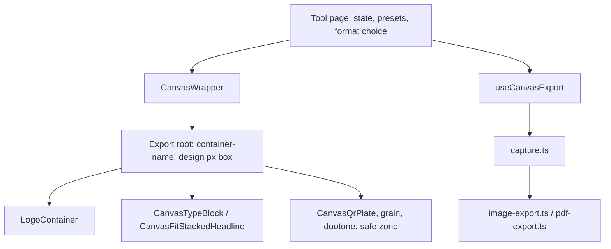

# Canvas Core — shared canvas engine spec

Proposed engine for every UnionOps visual canvas tool (posters, flyers, social graphics,
QR sheets, wallpapers). Companion documents:

- Audit and defect inventory: [`docs/audit/canvas-core-audit-2026-09-06.md`](../audit/canvas-core-audit-2026-09-06.md)
- Working rule: [`.cursor/rules/canvas-core.mdc`](../../.cursor/rules/canvas-core.mdc)
- Existing visual system: [`docs/modules/COMMS_VISUAL_SYSTEM.md`](COMMS_VISUAL_SYSTEM.md)

**Status:** Wave 0–4 implemented 2026-09-07 (engine + denser print ~200 PPI browser-safe + print family + fluid/intrinsic tools + A4/aspect registry + proportion guards).

## Why

Fourteen tools each solve viewport fit, logo placement, safe margins, and export density
their own way. The audit measured the result: logos consuming 81% / 58% / 44% of canvas
width across three sizes of the same tool, non-proportional padding, previews pinned at
design size, and letter exports at 144 PPI against a documented 300 DPI target.

The export **pipeline** is already shared and healthy. What is missing is a shared
**geometry** layer.

## Scope decision

This engine supersedes `.cursor/rules/comms-visual-system.mdc`'s "Do not collapse all
tools into one layout engine" and "Do not port Board FitWidth to every tool". Those rules
must be rewritten in the same change that lands Wave 0 — see Wave 4.

It does **not** merge export lanes. `.cursor/rules/export-engine-parity.mdc` stands:
raster PDF (`pdf-export.ts`), text PDF (`text-pdf-layout.ts`), and Office
(`office-export.ts`) remain separate writers. `useCanvasExport` unifies the **raster lane
only**.

## Architecture



New namespace `src/components/canvas-core/`:

| Module | Responsibility |
|---|---|
| `types.ts` | `CanvasConfig`, `AssetBounds`, `ExportOptions`, `SafeZoneProfile`, `CanvasAspectId` |
| `CanvasWrapper.tsx` | Aspect lock, design-px box, container establishment, fit-to-column scaling with optional upscale |
| `LogoContainer.tsx` | Canvas-relative logo slot with per-variant aspect and bounds |
| `safe-zone.ts` | One proportional margin / bleed scale |
| `use-canvas-export.ts` | `useCanvasExport` over `useExportHandler` + the raster helpers |
| `index.ts` | Re-exports, including the primitives moved from `components/tools/canvas/` |

### CanvasWrapper

Owns three things that are currently scattered:

1. **The scaling transform**, applied to a *parent* of `[data-export-root]` — never the
   root itself, because `capture.ts` zeroes `transform` on the clone.
2. **The container context**, via `container-name` plus a `container-type` chosen by the
   canvas mode (see below).
3. **The design-px box**, so `capture.ts` reads correct `offsetWidth`/`offsetHeight`.

It replaces `FitWidthFrame`, which becomes a thin re-export during migration so its five
current consumers keep working untouched.

Key behavioural change: scale is `clamp(minScale, columnWidth / designWidth, maxScale)`
rather than `Math.min(1, …)`, so a sheet may grow to fill a wide column (CANVAS-003).

### Container mode (critical)

`container-type: size` applies size containment in **both** axes, so a
content-driven canvas would collapse to zero height. The engine must therefore support
two modes, and `CanvasConfig` must declare which one applies:

- **`fixed`** — both dimensions known (letter, A4, 1:1, 16:9). Uses
  `container-type: size`. Both `cqw` and `cqh` are available.
- **`intrinsic`** — height follows content (pulse-poll, board-banner strips,
  logo-builder rectangle). Uses `container-type: inline-size`. **`cqh` is unavailable**;
  express vertical rhythm in `cqw` or `em`.

Getting this wrong collapses the canvas, so it is a type-level decision rather than a
styling convention.

### LogoContainer

Fixes CANVAS-001. The logo slot sizes from the canvas, not from a fixed px map:

- width as a `clamp()` in `cqw`, so proportion holds at 198px and at 4000px
- an aspect lock resolved **per logo variant** — wide lockups (~4.4:1), standard
  lockups (2.5:1), and marks (1:1) cannot share one ratio (BLIND-010)
- `AssetBounds` caps so a wide lockup can never occupy the full content width again
- standardized alignment shared across suites

Generalizes the pattern already proven inside an export root by
[`LocalLogoPlate.tsx`](../../src/components/brand/LocalLogoPlate.tsx) `size="fluid"`.

### Safe zone and bleed

One proportional scale replaces per-tool padding math, folding in the existing
[`edge-clearance.ts`](../../src/lib/utils/edge-clearance.ts) profiles. Print formats gain
an explicit bleed allowance and an optional crop-mark toggle (EDGE-010, QOL-009), with
the dashed overlay staying **outside** the capture node.

### useCanvasExport

Wraps [`useExportHandler`](../../src/hooks/use-export-handler.ts) and the raster helpers
behind one call, and centralizes density in `resolveExportPixelRatio(config)` so the
2x / 3x / 4x / ratio-math spread (CANVAS-006) collapses to a single policy driven by
`targetWidthPx`.

Also closes:

- `exportNodeAsSvg` gains `withUnscaledAncestors` + style inlining (CANVAS-007)
- `exportNodeAsBlob` default `pixelRatio` aligns with `exportNodeAsPng` (CANVAS-006)

## TypeScript contracts

```ts
export type CanvasMode = "fixed" | "intrinsic";

export interface CanvasConfig {
  aspect: CanvasAspectId;         // "letter" | "a4" | "tabloid" | "1:1" | "4:5" | "16:9" | "9:16"
  mode: CanvasMode;               // drives container-type; see Container mode
  designWidthPx: number;          // authoring basis that cq units resolve against
  designHeightPx?: number;        // required when mode === "fixed"
  medium: "print" | "digital";
  safeZone: SafeZoneProfile;
  bleedCqw?: number;              // print only
}

export interface AssetBounds {
  maxWidthCqw: number;
  maxHeightCqh?: number;          // unavailable in "intrinsic" mode
  aspectRatio?: number;           // resolved per logo variant
  align: "start" | "center" | "end";
}

export interface ExportOptions {  // extends CaptureOptions
  format: "png" | "pdf" | "svg" | "zip";
  pixelRatio?: number;
  targetWidthPx?: number;         // preferred over hand-tuned ratios
  backgroundColor?: string | null;
}
```

## Prerequisite: capture allowlist

`CAPTURE_STYLE_PROPS` in [`capture.ts`](../../src/lib/export/capture.ts) must gain
`borderTopWidth`/`Right`/`Bottom`/`Left`, `borderStyle`, `aspectRatio`, `flexBasis`,
`flexGrow`, `flexShrink`, `backgroundSize`, `backgroundPosition`. Without this, `cqw`
used in those properties resolves live but is never flattened onto the capture clone
(CANVAS-010). This is a hard blocker for Wave 1, with unit coverage in `capture.test.ts`.

## Export density policy

Letter previously exported 1224×1584 (~144 PPI) because design width was 306px and
`printPageExportPixelRatio` clamped at 4.

Canvas Core raises **design width** to 850px (`PRINT_PAGE_PX_PER_INCH = 100`) and targets
**1700px** letter rasters (~200 PPI, ratio 2). Hitting 2550px (~300 PPI) OOMs Chromium
`html-to-image` on letter sheets in practice — keep the browser ceiling at 1700 until a
non-browser export path exists. Always validate against real PNG dimensions.

## Migration strategy

Build the core first; migrate one tool at a time behind passing smoke rows. Every tool
keeps shipping throughout.

**Wave 0 — core.** Contracts, `CanvasWrapper`, `LogoContainer`, `safe-zone`,
`useCanvasExport`, capture allowlist, SVG/blob export fixes. `FitWidthFrame` becomes a
re-export.

**Wave 1 — flyer-maker.** Highest measured defect. Remove `maxWidth: 100%` from the
capture root, adopt `CanvasWrapper` with `maxScale`, denser design width.

**Wave 2 — fixed-px print family.** board-notice, solidarity-poster, org-chart, qr-board,
qr-card, action-card.

**Wave 3 — aspect and intrinsic family.** graphic-maker, quote-card, meeting-background,
resizer, pulse-poll, logo-builder, board-banner.

**Wave 4 — formats, rules, docs.** Format registry expansion, rule rewrites, migration
register, What's new note, proportion guards.

### Migration register (shipped 2026-09-07)

See [`docs/audit/session-knowledge-2026-09-07-canvas-core.md`](../audit/session-knowledge-2026-09-07-canvas-core.md)
for the live tool table. `printPageScaledTokens` remains for tools that still scale type
from the legacy 306px reference while authoring at denser design widths.

## Format registry

New shared `src/lib/comms/canvas-aspects.ts` covering existing print sizes plus **A4
(210x297mm)**, **1:1**, **4:5**, and **16:9**, wired into `FLYER_FORMATS`,
`BOARD_NOTICE_FORMATS`, `SOLIDARITY_POSTER_FORMATS`, and the graphic/quote aspect
helpers — including sizes not yet surfaced in any tool UI, so the engines stay ready.

`printPageExportPixelRatio` already accepts arbitrary inches; A4 needs only mm-to-inch
conversion. New labels require EN and FR entries whose claims match.

## Guards

Extend [`e2e/helpers/canvas-layout.ts`](../../e2e/helpers/canvas-layout.ts):

- `expectPreviewFitsColumn` gains **height and aspect** assertions — today it checks
  width only, which is why the flyer defect passes CI (CANVAS-013)
- new `measureCanvasProportions` / `expectCanvasProportions` asserting logo and padding
  percentages stay within a band **across every size of a tool** — the exact 81/58/44
  spread that proves CANVAS-001
- a minimum effective font-size assertion (BLIND-011)
- at least one French row per layout class (BLIND-012)

Wire into [`e2e/tools.layout-matrix.smoke.spec.ts`](../../e2e/tools.layout-matrix.smoke.spec.ts)
per migrated tool. Keep `npm run test:export` (`compareRasters`) green as the fidelity
backstop, and expect baseline churn (BLIND-005).

## Verification per wave

```
npm run lint
npm run test:unit
npx playwright test e2e/tools.layout-matrix.smoke.spec.ts e2e/tools.qr-share.smoke.spec.ts e2e/tools.export.smoke.spec.ts --workers=1
npm run test:export
```

Single worker is deliberate: these suites are flaky in parallel on this machine and pass
serially (BLIND-006).
