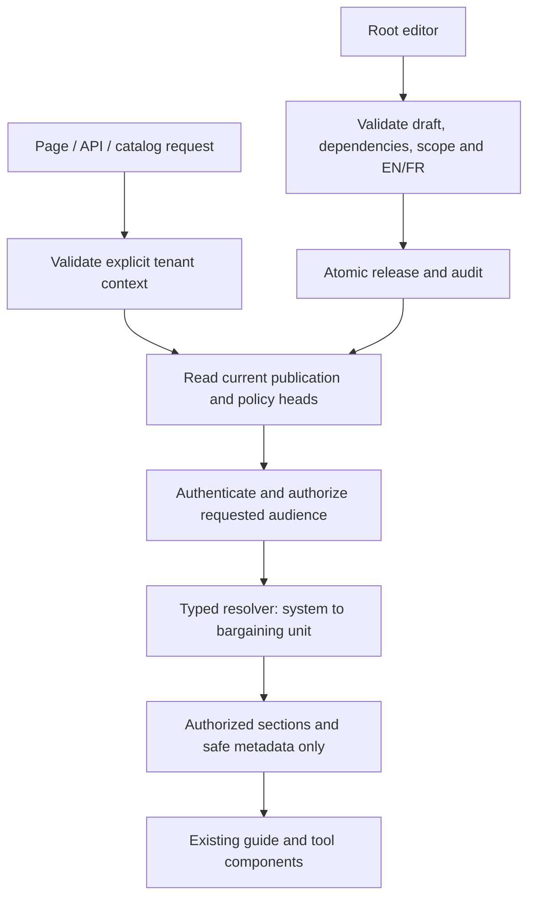

# Union and sub-collective customization layer

**Status: accepted design; C01–C04 foundation implemented, not connected to production consumers. C05–C15 remain pending.**

**Prepared:** 2026-09-22 against checkout `1f68490`.  
**Execution companion:** [implementation handoff](../audit/plan-2026-09-22-union-customization.md).

Implementation boundary: `src/lib/customization/` provides strict Zod payload/scope contracts, a code-owned tool configuration registry, versioned manifest validation, a pure authoring resolver, authorization decisions and C04 persistence adapters. Migration 0054 stores scopes, immutable releases and audience filtered fragments under RLS. Resolver output and raw authoring rows are internal data, not an authorized reader DTO; ordinary delivery must use `readerTransaction` followed by C05's current-policy projection. Existing pages/Brand Kits are not connected. C05–C15 remain future work. See the [module README](../../src/lib/customization/README.md).

## 1. Recommendation and review of the requirements

Build a typed, hierarchical content/configuration resolver inside the existing Next.js application, backed by versioned PostgreSQL records and a Root Admin editor. Keep compiled generic content as the fallback. Do not introduce executable plugins, a second CMS service, arbitrary HTML, or a second authorization system. A new guide assembled from supported blocks, a source URL, branding values, or supported workflow parameters must be publishable without rebuilding the application. New tool implementations and new block types still require code.

The requested direction fits UnionOps, with these corrections:

| Requirement | Design decision and reason |
|---|---|
| System → union → sub-collective | Use system → union → optional division → local → optional bargaining unit. CAAT Academic and Support are sibling division-level examples, not a local and not two global defaults. FT/PT agreement differences belong to bargaining units where applicable. |
| Root Admin | Use the existing `platform_admin` identity with new customization capabilities. Do not add a competing `root_admin` role. Root is a platform operator role, not a hardcoded email. |
| Only Root edits at launch | All new shared customization mutations, including local shared overrides, remain Root-only in Phases 1–2. Existing personal Brand Kit editing and existing president configuration continue. Level 3 shared editing activates in Phase 3 within a published field allowlist. |
| Public/private toggles | Access control, enabled state, discovery, and commercial entitlement are separate decisions. Hiding a card is not authorization. Enforce access before generating any response body. |
| Enterprise monetization | Prepare optional hosted customization/maintenance entitlements. Preserve free generic public Comms. A private union guide or hosted add-on is eligible; putting the existing public poster editor behind a paywall is not this proposal. |
| Infrastructure before content | Ship an empty administrative workspace and synthetic fixtures first. Root creates real union structures, mappings, sources, and bilingual content after deployment. Do not automatically copy the OPSEU seed into new tenants. |

This design deliberately preserves existing compiled union material until explicitly migrated. “Generic defaults at launch” applies to the new resolver's no-context path; removing all existing reference examples is a separate editorial project. Launch requires reviewing pilot fallback pages so an unselected visitor does not receive a union-specific operational instruction as a universal rule.

## 2. As-built integration map

Paths below are observed implementation anchors, not claims that the new feature exists.

| Existing code | Observed behavior | Planned use |
|---|---|---|
| `src/lib/db/schema/tenant.ts` | Unions, divisions, locals, bargaining units; a local has at most one division | Reuse tenant identities; validate parentage with composite constraints |
| `src/lib/tenant/loader.ts` | Seed/overlay context; `resolveGrievanceConfig` resolves collection then union | Preserve legacy fallback; add an async customization service rather than silently changing the synchronous function |
| `src/lib/authorization/model.ts`, `resolve-actor.ts` | Active memberships, assignments and local capability delegations; database actor when configured | Reuse actor identity; extend with a separate, bounded content-maintenance grant type |
| `src/lib/auth/site-admin-session.ts` | Platform operator + configured MFA policy gate | Entry guard plus fresh account/role check for editor operations |
| `src/lib/db/schema/organization-access.ts` | Existing delegations require `localId` | Do not store union-wide grants using fake locals or nullable reinterpretations |
| `src/lib/public-tools/*`, `schema/public-tool-settings.ts` | Platform/union/local disabled-tool lists and server availability helper | Keep disable-wins precedence; compose audience checks afterward |
| `src/lib/brand/brand-registry.ts`, `identity-packs.ts`, `constants/unionPresets.ts` | Compiled presets/Looks; browser Brand Kit identities | Add a read adapter for published baselines; explicit user application of defaults |
| `src/components/comms/SourcesBlock.tsx` | Client-side source filtering from hydrated Brand Kit preset | Safe only for already-public sources; add server-projected dynamic sources |
| `src/lib/comms/guide-registry.ts`, `public-catalog.ts` | Compiled discovery metadata, not a runtime CMS | Compose published entries into the same discovery service |
| `src/lib/seo/public-routes.ts` | Canonical `/learn` and `/create` with legacy redirects | Preserve canonical routes; introduce a reserved custom-guide namespace |
| `src/lib/db/rls-context.ts` | Explicit route/service transaction wrapper, no automatic scoping | Every new tenant query executes inside a verified target context |
| `docker/db-deploy.mjs`, `src/lib/db/rls-contract.ts` | Verified forward-only schema deploy | Append migration and RLS contract; never revive `platform_meta` |

The generalized actor currently rejects union mismatch even for platform admins. Do not weaken `decideCapability` across the application to implement Root editing. Use a content-only operator target authorization path and a transaction explicitly bound to that target union. It confers no grievance, membership-roster, or Portal content privileges.

## 3. High-level architecture and resolution



### 3.1 Scope and context

Resolution uses the exact chain `system → union → division? → local? → bargainingUnit?`. Optional levels are skipped, never guessed. Each level is unique; no multi-parent or arbitrary-depth inheritance in v1. A local without a division inherits directly from its union. A selected bargaining unit must belong to the selected local and union. Wrong/missing parents are errors, not reasons to broaden scope.

The existing one-division-per-local schema cannot represent every amalgamated organization. V1 uses the current schema and reports unsupported structures in the admin UI; never manufacture a valid-looking parent. Supporting multiple sectors per local requires a later ADR and explicit binding semantics.

Keep two contexts separate:

* **Presentation context:** an explicitly selected published union/division/local. Public visitors can choose it. A Brand Kit preset can suggest a published mapping but supplies no authority.
* **Authorization context:** current account, active membership, office assignments and maintenance grants, resolved server-side. Forging a URL, cookie, preset, local number or collection profile must never create membership.

Use a proposed `customization_preset_bindings` mapping from compiled preset/sector IDs to a real union/division, maintained by Root. Never equate a preset string with a tenant primary key. Local numbers are not globally unique; lookup requires union scope. No implicit OPSEU or first-seed selection. Unrecognized explicit slugs return 404; genuinely absent context uses the neutral compiled defaults.

### 3.2 Resource and merge contract

Use stable keys (`guide:<catalog-id>`, `tool:<registered-slug>`, `brand:baseline`, `workflow:<registered-id>`, `source:<uuid>`). Resource kind and key never change through an override. An override cannot create executable code, register an arbitrary route, turn on a Hub module, or change tenancy.

| Data | Merge rule |
|---|---|
| Scalar | Missing operation inherits; `set` replaces; `clear` is valid only on nullable fields |
| Branding | Allowlisted color/logo/font/label tokens; no arbitrary CSS; local number stays local |
| Guide blocks | Stable block IDs; explicit add/replace/remove/order operations, never array-index patches |
| Sources | Stable IDs with add/replace/remove; visible block references must resolve to visible sources |
| Workflow | Replace the complete validated configuration version; no merging deadline arrays |
| Audience | Descendants may tighten, never loosen inherited restrictions |
| Enabled | Any platform/module/resource ancestor denial wins |
| Local-editable fields | Intersection of ancestor allowlists; children cannot grant themselves a field |

Reject unknown keys, duplicate block IDs, invalid reorder sets, dangling references, cycles, and excessive sizes. Do not use a generic recursive JSON merge. Array replacement and explicit patch operations are schema-specific and tested.

Example: system guide has `prepare`, `meeting`, `follow-up`. A union replaces `meeting`; division adds `college-context`; local adds an approved contact parameter. Provenance identifies each contributing scope/revision. When the union deletes `meeting`, a local patch targeting it becomes a publish conflict; it must not silently disappear or attach to the new block at the same array index.

### 3.3 Runtime algorithm

1. Validate resource key, locale and tenant chain. Resolve fresh actor only when needed; public context is not a member identity.
2. In one consistent DB read transaction, read active scope/resource heads, withdrawal/policy controls and relevant enabled-state configuration. Distinguish missing data from database failure.
3. Authorize resource access against the current inherited policy, membership and entitlement. Do not fall back to generic content on the same scoped resource when authorization fails.
4. Obtain permitted immutable published fragments in one batch, compiled from exact dependency revisions at publication. The authoring/compiler path may read raw revisions; ordinary reader requests may not. Record provenance server-side.
5. Filter sections, sources, attachments, TOC and discovery fields on the server. Serialize only the permitted DTO. Do not send the full document with `hidden: true` flags.
6. Return an allowed DTO, a denied result, or an unavailable result. Management diagnostics may explain conflicts; ordinary responses must not reveal private titles or revision IDs.

No customization anywhere means compiled fallback. An absent override at a level means inheritance. An explicit withdrawn resource means unavailable, not fallback. A failed DB lookup is not an absent override: return 503 for customization-dependent routes, while independent generic public routes remain usable.

### 3.4 Revisions and dependency updates

Published releases are immutable and pin ancestor revision dependencies. A publication head selects the active release for a scope/resource. This makes preview, rollback and orphan detection reproducible.

Ancestor publication runs an impact preview and rebases dependent active releases. Unchanged inherited blocks advance; conflicting edits require explicit resolution. For the bounded v1 workload, publish parent and all affected descendant heads atomically after validation. Cap a publish operation at 500 affected releases; above that return a clear preparation error. A staged asynchronous bulk compiler is future work, not a partly atomic publish.

Capture expected ancestor heads while preparing the release, then lock/recheck them in deterministic scope/key order in the publication transaction. An intervening edit returns 409; the server must not silently publish against a different parent.

Emergency withdrawal or audience tightening is an independent current policy operation. It immediately hides affected descendants even if editorial rebase conflicts exist. Ordinary editorial rollback creates a new release pointing to historical content; it does not undo current restrictive policy. Loosening policy requires a separate explicit Root action and current dependency validation.

## 4. Access control and administrative governance

### 4.1 Capability model

Proposed capabilities: `customization.readDraft`, `customization.edit`, `customization.publish`, `customization.policy.manage`, `customization.localParameters.edit`, `customization.grants.manage`. These are content/configuration capabilities, not extensions of confidential casework access.

| Actor | Phases 1–2 | Phase 3 |
|---|---|---|
| Root / `platform_admin` | Create scopes; edit/publish/withdraw; sources/brands; audit | Same plus grant/revoke maintenance and manage hosted entitlements |
| Existing `union_admin` / `division_admin` | No new shared-edit authority from role alone | Only explicitly granted scope, resource kinds and actions |
| External maintainer | No shared-edit access | Term-bounded grant; draft editor by default, separate publish grant; never grant onward |
| Local executive/officer | Read according to membership/office; existing configuration unchanged | Allowed local parameters with active local assignment and explicit feature activation |
| Steward | Existing personal tools; no baseline edits | Explicit scoped parameter delegation, not baseline publication |
| Verified member | Published content in authorized scope | Same |
| Anonymous | Public projections only | Same |

Grant checks include active account, starts/ends timestamps, revocation, target union, optional division/local subtree, resource kinds, capability, and MFA for writes. Resolve grants on every protected request; a JWT role label cannot keep a revoked grant alive. New union-maintenance grants live in their own table because existing `authority_delegations` are local-scoped. Share authorization decision types and audit conventions; do not build another account/session system.

The initial editor requires durable PostgreSQL accounts and actual MFA in production. `requireSiteAdminSession` follows configured MFA policy, so it alone is insufficient when MFA is disabled. New publishing must also require production MFA readiness and a database-resolved active platform role. Memory adapters exist only for tests and labeled demos; a production write cannot silently fall back to them.

Local parameter authorization is not permission to upload a whole document. The server computes an allowed field set from the union release, compares the submitted patch, rejects every extra field, and revalidates the full result. Even Root cannot bypass schema, same-union parentage, or the free-Comms product invariant through an ordinary editor action.

### 4.2 Root cross-union path and RLS

Administrative routes take an explicit target scope. First authenticate Root against current account state; then enter `withRlsContext` for that exact target union and user. Implement content-specific RLS predicates that recognize a verified active Root or a matching maintenance grant. Do not rely on `crossLocal: true` as permission to write baseline tables. No owner credential in web requests, no wildcard tenant ID, and no global `BYPASSRLS` switch.

Platform-system scopes are a separate explicitly platform-owned case. Use a `scope_kind = 'system'` constraint with null union only for that case; null union never means all tenant rows. Tenant records always carry a real `unionId`, including child content records and release projections. Public reads are a documented exception for intentionally published projections, not permission to read tenant authoring tables.

RLS must enforce both `USING` and `WITH CHECK` for writes and same-scope parent relationships. Avoid policy recursion through grant/account lookups. If a narrow security-definer helper is necessary, freeze its search path, schema-qualify all objects, revoke public execution, and return only a bounded boolean or projection. Test it as `unionops_app`, never only as owner. PostgreSQL owners normally bypass row security; owner tests cannot prove isolation ([PostgreSQL RLS documentation](https://www.postgresql.org/docs/17/ddl-rowsecurity.html)).

Separate **authoring access** from **published delivery** at the database boundary. Raw drafts/revisions are readable only by Root and explicitly authorized maintainers. The publisher compiles resolved content into `customization_delivery_fragments`, split by block/source/metadata and minimum audience. Reader RLS checks each fragment against the current publication head, all current ancestor restrictions, and the requested target scope's membership/office requirements. Inherited fragments carry the resolved target scope, not just their source author's scope. A verified member cannot SELECT an officer-only fragment inside an otherwise member-readable guide. Application projection repeats these checks; it does not compensate for granting readers unrestricted raw revision SELECT. Public projections contain only public fragments and are also subject to current controls. All joins must retain union/target scope. The runtime adapter batches permitted fragments, rather than resolving raw private document JSON in a browser or exposing it through a generic revision endpoint.

Audit create/edit/publish/rollback/withdrawal/policy/grant actions with actor, target union/scope, resource/revision IDs, reason, expected/new versions and result. Include operator target selection in the event. Do not log full guide bodies, private sources, tokens or uploaded bytes. Audit and publication commit together; audit failure aborts the mutation.

## 5. Data modeling and schema strategy

Use relational ownership/lifecycle and versioned Zod-validated JSONB payloads. TypeScript types alone do not validate stored or submitted JSON. All IDs are opaque text IDs consistent with the repository; all timestamps are timezone-aware. Proposed table names below are new.

| Table | Essential columns and constraints |
|---|---|
| `customization_scopes` | `id`, `kind` (system/union/division/local/unit), `unionId`, `divisionId`, `localId`, `bargainingUnitId`, `parentScopeId`, `archivedAt`; exact shape CHECK per kind, one scope per corresponding tenant identity, parent kind/tenant validation |
| `customization_resources` | `id`, `scopeId`, `unionId`, `key`, `kind`, `slug`, `createdBy`, `archivedAt`; unique `(scopeId,key)` and custom-guide `(scopeId,slug)`; kind immutable |
| `customization_drafts` | `resourceId`, `schemaVersion`, `payload`, `baseReleaseId`, `ancestorHeads`, `lockVersion`, `updatedBy/At`; one shared draft per resource, optimistic locking |
| `customization_revisions` | `id`, `resourceId`, `scopeId`, `unionId`, `revisionNo`, `schemaVersion`, `payload`, `contentHash`, `createdBy/At`, `changeReason`; immutable; unique `(resourceId,revisionNo)` |
| `customization_releases` | `id`, `resourceId`, `revisionId`, `dependencyManifest`, `compiledDefaultVersion`, `publishedBy/At`, `replacesReleaseId`; immutable accepted publication |
| `customization_heads` | `resourceId`, `activeReleaseId`, `generation`, `updatedAt`; one pointer; generation increments in compare-and-swap transaction |
| `customization_policy` | `resourceId`, `audience`, `enabled`, `withdrawnAt`, `publicListing`, `publicTeaser`, `policyVersion`, `editableFields`, `entitlementKey`; inherited restrictions apply; section policy uses stable block IDs in validated payload plus current tightening controls |
| `customization_section_controls` | `resourceId`, `blockId`, `minimumAudience`, `withdrawnAt`, `policyVersion`, `updatedBy/At`; current emergency restrictions for stable block IDs, propagated to dependent fragment delivery checks |
| `customization_public_projections` | `resourceId`, `releaseId`, `scopeId`, `unionId`, `locale`, `publicDto`, `policyVersion`; sanitized materialization, no drafts/private sections; unique `(releaseId,locale)` |
| `customization_delivery_fragments` | `releaseId`, `scopeId`, `unionId`, `locale`, `fragmentId`, `kind`, `ordinal`, `minimumAudience`, `payload`; immutable resolved block/source/metadata fragments; unique `(releaseId,locale,fragmentId)`; reader RLS excludes unauthorized fragments |
| `customization_maintenance_grants` | `id`, `userId`, `unionId`, `scopeId`, `capabilities`, `resourceKinds`, `startsAt`, `endsAt`, `revokedAt/By`, `grantedBy`, `reason`; nonempty allowlists, end after start, no system-scope delegation |
| `customization_preset_bindings` | `presetId`, optional `sectorId`, `unionId`, `scopeId`, `publishedAt`, `updatedBy`; unique normalized preset/sector combination; target same union |
| `customization_assets` | `id`, `unionId`, `scopeId`, `storageKey`, `mime`, `bytes`, `hash`, `scanStatus`, `rightsNote`, `altText`, `createdBy/At`; separate access from the uploaded URL |

Sources are resources of kind `source` with immutable revisions rather than an unversioned URL column copied into every guide. A source payload includes EN/FR label/note, URL, publisher, jurisdiction, applicability, checked date, review-due date and rights/attribution. A guide pins source revision dependencies. Updating a URL enters the same rebase/impact process. Existing `comms-sources.ts` remains the compiled fallback authority until explicitly migrated.

Use composite unique keys and foreign keys for `(scopeId,unionId)`, `(localId,unionId)`, `(unitId,localId,unionId)`, and child-to-parent resource/revision references. Because SQL null semantics complicate the system scope, enforce system rows separately with CHECKs/partial unique indexes; do not trust a nullable composite FK alone. Parent graph creation is server-controlled with a fixed depth; validate it again in a DB trigger or equivalent constraint function. Archive owned records; use RESTRICT for referenced published revisions. Tenant deletion/purge must explicitly account for the new tables and retention obligations before it is enabled.

Indexes: resources `(scopeId,key)`, scopes on each tenant identity, heads by resource, revisions `(resourceId,revisionNo DESC)`, releases by resource and dependency lookup, grants `(userId,unionId,endsAt)` with nonrevoked filtering, projections `(scopeId,locale,resourceId)`. Set initial limits: 256 KiB draft JSON, 100 blocks/guide, 100 source references, 5 MiB raster asset, 500 affected releases/publication. Return actionable validation errors; revisit limits using measured workloads.

### 5.1 Payload contracts

```typescript
// Proposed contracts; implement as discriminated Zod unions, not unchecked casts.
type Audience = 'public' | 'verified_member' | 'local_officer';
type GuideBlock = {
  id: string;
  type: 'heading' | 'paragraph' | 'list' | 'callout' | 'steps' | 'sourceList';
  audience: Audience;
  content: { en: BlockContent; fr: BlockContent };
  sourceIds: string[];
};
type ResolvedContent = {
  key: string;
  locale: 'en' | 'fr';
  title: string;
  blocks: AuthorizedBlock[]; // Unauthorized bytes never enter this DTO.
  sources: AuthorizedSource[];
};
```

`BlockContent` is a type-specific structure: text and explicit safe inline link/emphasis nodes; no raw HTML, JSX, MDX, script, iframe or CSS. Unknown schema versions fail publication and return a controlled unavailable state at read time. Brand fonts reference the existing local font catalog; logos use validated uploaded raster assets or approved bundled identifiers. No arbitrary remote font or asset execution. Accessibility validation includes heading structure, descriptive links and meaningful image alt text.

Runtime guide content stores EN/FR values in the database; application chrome remains in `messages/en.json` and `messages/fr.json`. Drafts may be incomplete; v1 publication requires both locales and an explicit reviewed marker. Do not silently present English as French. Locale fallback applies to the same permitted resource only; it must not expose a less restricted ancestor revision. A future intentionally single-language policy requires a separate visible language-fallback design.

Store per-locale `reviewedBy`, `reviewedAt` and reviewed content hash in revision payload metadata; any text change invalidates that locale's review. A checkmark copied from an earlier draft is not proof that new wording was reviewed. Review is an editorial attestation, not automated translation certification.

### 5.2 Lifecycle and concurrency

`absent → draft → validated preview → published release → superseded/withdrawn`. Saving a draft increments `lockVersion`; `If-Match` mismatch returns 409 with safe conflict metadata. Publishing snapshots a revision, validates pinned dependencies and bilingual fields, creates projections, advances all affected heads and records audit in one transaction. Require an idempotency key and persist its operation result scoped by actor, target and request hash; retrying the same key/body returns the original result, while a changed body returns conflict.

For Phase 3 publication, serialize the authorization check with grant/account revocation using the same row-lock order in both operations; re-read grant validity and server time inside that transaction. The content-only operator target context does not substitute for this check. A revocation committed before publication's locked authorization check must deny the publish.

Rollback copies a historical revision into a new draft and runs the normal validation/publish path. Never UPDATE historical JSON or reset sequence numbers. Removing an override is an explicit “inherit again” operation with a preview; withdrawing content is an explicit deny. They must have different UI actions and audit events.

Compiled generic defaults also need stable block IDs and a content manifest version. Releases pin that version. Retain manifests needed by active releases, or rebase those releases before removing a manifest. A code deploy must not silently orphan a database patch. Unsupported compiled components cannot be magically converted into JSON; see the migration boundary below.

## 6. Visibility and public/private engine

### 6.1 Exact decision rules

Evaluate enabled/module restrictions first, current policy second, authenticated relationships third, entitlement last. Entitlement can remove access but can never grant membership or officer authority.

| Audience | Required evidence |
|---|---|
| Public | Active published resource and permitted public projection; no login |
| Verified Member | Active account plus current active membership in the resource union; local-scoped content requires that exact local; unit-scoped content requires that unit relationship |
| Local Officer | Verified member conditions plus an active canonical officer assignment in the selected local; unit restriction still applies; union/division-wide officer content requires an eligible local within that scope |

Pending invitations, email domain, sign-in alone, a Portal screen, imported Data workbench person records, `accessibleLocalIds`, and a Brand Kit identity are not verification. Division-scoped content checks the local's division. Maintenance grants allow the specified administrative preview/edit actions but do not make the maintainer a member for ordinary viewing. Root preview is an explicit audited management route, not a hidden reader bypass.

For each section use the strictest audience among resource, ancestor policies and section. A public child cannot widen a member-only parent. A private subsection in a public guide is allowed; omit its heading, body, source references and counts unless Root separately writes an intentionally public teaser. A source with a stricter audience than its consuming section is a publish error. Files inherit at least the consuming resource restriction.

Anonymous access to a deliberately public teaser may show a login action. Unlisted private IDs return generic 404 to unauthorized callers. Authenticated management APIs return 403 for forbidden actions and 409 for edit conflicts. API authentication failure is 401. Do not leak resource existence through a detailed error before authorization.

### 6.2 Public interface and route boundary

Keep neutral canonical `/learn/*` and `/create/*` routes. Proposed new custom guides use `/[locale]/learn/custom/[unionSlug]/[guideSlug]`, with validated optional division/local/unit context parameters. These parameters affect presentation, never permission. Reserve the namespace in the route registry and reject collisions. Scoped overrides of existing guides use the existing canonical path plus explicit context; no cookie-only canonical identity. V1 contextual variants are `noindex` and omitted from the sitemap; the neutral route retains its canonical URL. An explicitly published public custom-guide base URL can be indexed after metadata review.

Add a server discovery service that composes the compiled catalog with authorized database entries. Search, Create/Learn cards, related links, breadcrumbs, TOC, metadata, JSON-LD, Open Graph, sitemap and exports all consume safe projections. Public JavaScript bundles cannot contain member-only text. Do not add private guide content to `messages/*.json`, the compiled catalog, static assets or service-worker caches.

Public pages can show selected union branding with a clear scope label while retaining UnionOps platform identity. Browser users explicitly choose “Apply baseline to this Brand Kit,” preview changes, and retain undo. Published updates do not overwrite saved kits on hydrate. Protected baseline data is not automatically persisted to localStorage. Personal Comms inputs/outputs remain on device; loading published defaults does not opt a user into `ApiAdapter`.

Private assets use authenticated streaming endpoints that recheck current policy, not permanently public storage URLs. Raster uploads must be type/size validated, scanned where required, and published with rights/attribution and alt text. V1 does not fetch arbitrary source URLs server-side; source review is manual. If a link checker is later added, separately implement SSRF defenses and handle national sites that reject automated HEAD requests.

### 6.3 Cache and revocation contract

V1 dynamically serves all customization-dependent routes and APIs with `Cache-Control: private, no-store` (including anonymous scoped variants). Disable full-route/static caching for them and exclude them from service-worker caching. Keep immutable revision/compiled-resolution objects in a bounded server cache keyed by resource, complete scope chain, dependency hashes, locale and schema version. Never cache a member's authorization decision or final private DTO across requests.

Read current heads, restriction versions and membership/grants from the database on each request. Recheck permissions even on a resolution cache hit. Do not expose immutable revision URLs as a bypass around current withdrawal. Public projection reads must join current head and current restriction state; a formerly public projection is not public forever.

This deliberately trades one small indexed control read for predictable revocation across replicas. Optional future public CDN caching needs a separately tested revocation SLA and purge mechanism. Stale-while-revalidate invalidation is unsuitable as the only control for access tightening: Next.js documents that `revalidateTag` with the `max` profile can serve stale content while refreshing ([Next.js reference](https://nextjs.org/docs/app/api-reference/functions/revalidateTag)).

Revocation applies to requests authorized after the commit. It cannot recall a response already sent, downloaded export, screenshot or previously public page. Do not promise retroactive secrecy. In-flight requests use a consistent snapshot; a stricter immediate-cancellation guarantee would need a different serving model.

## 7. Workflow, tools and content migration boundaries

Tool configurations are a registry of explicit per-tool schemas and supported parameters. Root can change labels, default choices, approved instructions and permitted workflow configuration; it cannot upload executable tool logic. Existing platform disabled lists, Hub `enabledModules`, and domain API checks remain authoritative.

Generic tools remain publicly available under the Comms promise. A scoped private tool configuration requires login before loading that configuration; the neutral public tool remains available. A future hosted-only tool may require membership/entitlement at page, action, API and export boundaries. A client-only tool whose implementation is shipped to the browser cannot be treated as a DRM-protected executable.

Grievance deadlines are operational data, not editorial guide text. Integrate workflow customization only through a versioned `CAConfig` boundary with full schema validation and an effective date. New cases record their workflow revision/snapshot. Existing cases retain their deadlines/configuration until an authorized, separately audited case migration explicitly changes them. Trace every current `resolveGrievanceConfig` consumer, exports and hybrid serialization before enabling a workflow schema. Do not change the existing synchronous fallback function as a shortcut.

Compiled TSX guides need an explicit conversion inventory. Classify each as: metadata/source-only customization; full structured-block renderer; or unsupported bespoke interactive content. Pilot one ordinary guide, one new custom guide and one tool configuration. Until a guide has stable blocks and a server resolver boundary, section editing/gating is disabled and clearly labeled unsupported. Existing public compiled text remains public even if a different scoped version is private. Do not claim every guide is dynamically editable at Phase 1 completion.

## 8. Performance, operations and failure cases

Initial performance goals, to measure rather than claim: warm resolver CPU p95 under 10 ms for 100 blocks; complete scoped content lookup p95 under 100 ms at 20 concurrent readers on the documented staging host, excluding network/rendering. Use one bounded control/authorization read and one batched content fetch, not one query per section. Set a bounded LRU budget (initially 32 MiB/process) and report cache misses without user/content payloads. Do not precompute all possible member combinations.

| Failure/edge case | Required behavior |
|---|---|
| Root updates a block referenced locally | Impact preview; compatible rebase or explicit conflict; no silent orphan loss |
| Withdrawal during rebase conflict | Current deny overrides pinned editorial release immediately |
| Two Root tabs publish | Version/ancestor compare-and-swap; one wins, other 409 |
| User switches local / membership expires | Fresh relationship check; no reuse of prior authorized DTO |
| Tenant/division/local archived | Hide descendant scoped routes; preserve history; no broad fallback |
| Invalid public context | 404, not automatic selection of the first tenant |
| DB or policy service unavailable | Scoped route 503; generic public routes remain independent |
| Disabled tool with public override | Disabled wins, at direct route/API and discovery |
| Grant revoked in another replica | Next protected request fails; no process-only authority cache |
| French missing or source unavailable | Publication blocks; draft remains editable; no silent language/source substitution |
| Public asset becomes private | Stop serving through current access endpoint; acknowledge prior disclosure |
| Rollback to old public revision | Current restrictive policy survives rollback |
| New compiled manifest removes a block | Compatibility validation before release; retain or explicitly rebase old manifest |

Deploy through ADR-020: additive Drizzle migration, journal integrity, generated required-shape contract and RLS contract, fresh/upgrade/restart verification. No fixed migration number in this proposal; choose the next unused journal entry at implementation time. Do not modify entrypoint or create a second data-version ledger.

Feature controls proposed: `CUSTOMIZATION_ENABLED` (off initially), `CUSTOMIZATION_DELEGATION_ENABLED` (off until Phase 3), and `CUSTOMIZATION_LOCAL_EDIT_ENABLED` (off until Phase 3). Production activation requires PostgreSQL and durable auth; startup/config validation rejects an unsafe combination. The UI flag is not the security boundary: turning off the editor must not make previously private scoped content public. An emergency serving kill switch returns unavailable on scoped customization routes; it never reveals their generic ancestor by accident.

Back up revisions, heads, grants, audit, and asset storage consistently; run a restore smoke on an isolated database. No hard deletion of referenced releases in v1. Use current governance retention as the initial policy, but have the operator document an actual retention/purge schedule before external maintainers upload private material. This is an engineering proposal, not a claim of legal compliance.

## 9. Acceptance and rollout summary

Phase 1 delivers resolver, durable storage/RLS, Root editor, revisions/preview/publication and pilot adapters using synthetic content. Audience enforcement and private-byte exclusion are foundation requirements in Phase 1 even though broad toggle UX and real content activation are Phase 2.

Phase 2 lets Root create the real baseline entirely through the UI, add CAAT sibling structures where appropriate, publish reviewed bilingual sources/guides/branding, activate visibility controls and migrate additional adapters. No OPSEU content is embedded in infrastructure migrations. Phase 2 is complete only when a second synthetic union proves the same path without code changes.

Phase 3 activates explicit union-maintenance grants, bounded local parameter editing, audited renewal/revocation, and hosted entitlement readiness. It does not add payments automatically. Pricing/billing integration is a separate product release; optional entitlement expiration must not delete data or disable generic Comms.

For concrete task ordering, file ownership, testing fixtures, operator steps and handoff prompts, use the [execution plan](../audit/plan-2026-09-22-union-customization.md).
